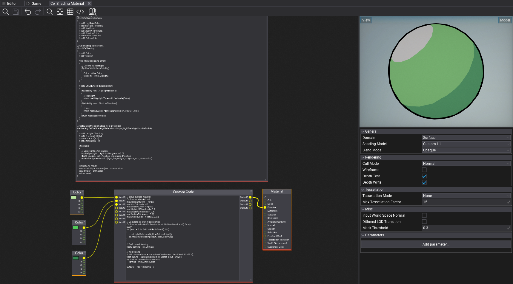
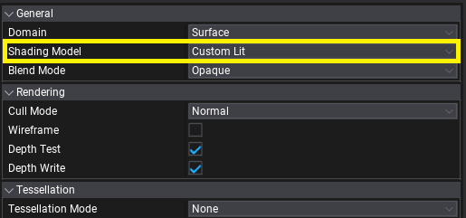
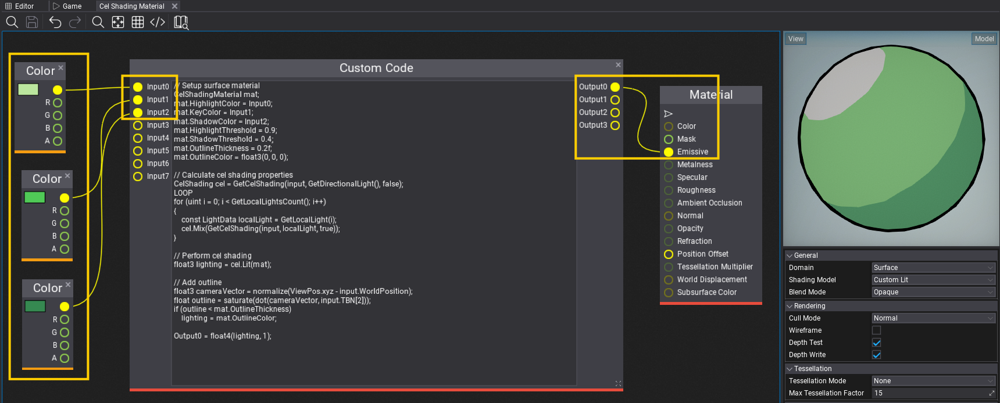

# Cel Shading



In this tutorial you will learn how to create **Cel Shading** effect, also known as **Toon Shading**.

## 1. Create a new material



Create a new [material](../materials/basics/index.md) and set **Shading Model** to **Custom Lit**. This mode exposes lighting information in a shader which contains:
* directional light,
* sky light,
* local lights (point, spot lights),
* environment probe,
* exponential fog.

It supports both opaque and transparent surfaces, particles, skinned meshes and deformables.

## 2. Write a shader for Cel Shading

Add new **Custom Global Code** node that implements cel shading based on the light inputs.

```hlsl
// Material properties
struct CelShadingMaterial
{
    float3 HighlightColor;
    float HighlightThreshold;
    float3 KeyColor;
    float ShadowThreshold;
    float3 ShadowColor;
    float OutlineThickness;
    float3 OutlineColor;
};

// Cel shading calculations.
struct CelShading
{
    float3 Color;
    float Visibility;

    void Mix(CelShading other)
    {
        // Use the highest light
        if (other.Visibility > Visibility)
        {
            Color = other.Color;
            Visibility = other.Visibility;
        }
    }

    float3 Lit(CelShadingMaterial mat)
    {
        if (Visibility > mat.HighlightThreshold)
        {
            // Highlight
            return mat.HighlightThreshold * saturate(Color);
        }
        if (Visibility > mat.ShadowThreshold)
        {
            // Key
            return mat.KeyColor * lerp(saturate(Color), (float3)1, 0.5);
        }
        return mat.ShadowColor;
    }
};

// Calculates the cel shading for a given light
CelShading GetCelShading(MaterialInput input, LightData light, bool isRadial)
{
    float3 L = light.Direction;
    float3 N = input.TBN[2];
    float NoL = dot(N, L);
    float attenuation = 1;

    if (isRadial)
    {
        // Local lights attenutation
        bool isSpotLight = light.SpotAngles.x > -2.0f;
        float3 toLight = light.Position - input.WorldPosition;
        GetRadialLightAttenuation(light, isSpotLight, toLight, N, NoL, attenuation);
    }

    CelShading result;
    result.Visibility = saturate(NoL) * attenuation;
    result.Color = light.Color;
    return result;
}
```

## 3. Write a shader for lighting and outline



Now, add a ***Custom Code** node that inputs 3 colors: highlight, key and shadow for the cel shading of this material. Those can be made as parameters to be customized per [Material Instance](../materials/instanced-materials/index.md). Output of the custom code node should go directly to the materials' Emissive as final lighting output.

```hlsl
// Setup surface material
CelShadingMaterial mat;
mat.HighlightColor = Input0;
mat.KeyColor = Input1;
mat.ShadowColor = Input2;
mat.HighlightThreshold = 0.9;
mat.ShadowThreshold = 0.4;
mat.OutlineThickness = 0.2f;
mat.OutlineColor = float3(0, 0, 0);

// Calculate cel shading properties
CelShading cel = GetCelShading(input, GetDirectionalLight(), false);
LOOP
for (uint i = 0; i < GetLocalLightsCount(); i++)
{
    const LightData localLight = GetLocalLight(i);
    cel.Mix(GetCelShading(input, localLight, true));
}

// Perform cel shading
float3 lighting = cel.Lit(mat);

// Add outline
float3 cameraVector = normalize(ViewPos.xyz - input.WorldPosition);
float outline = saturate(dot(cameraVector, input.TBN[2]));
if (outline < mat.OutlineThickness)
    lighting = mat.OutlineColor;

Output0 = float4(lighting, 1);
```

### 4. Test it out!

Finally, use this material on objects in your project. Those will react to the sun and local lights around with proper cel shading and outlines. This example shader could be further improved to support reflections sampling for fake-reflective surfaces or perform lights mixing differently. Also, outlines can be calculated in [PostFx Material](../post-effects/post-fx-materials.md) rather than inside a shader to provide normal-based or depth-based smoothing.


