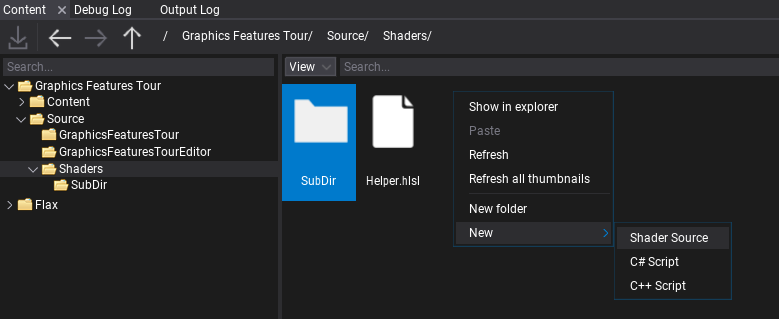
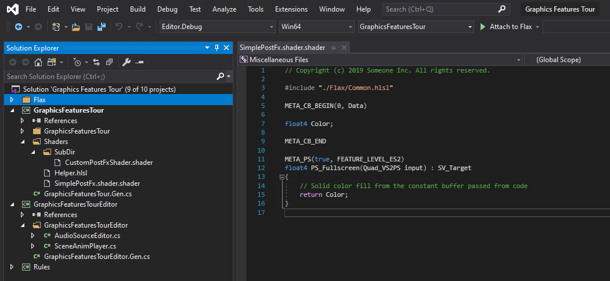
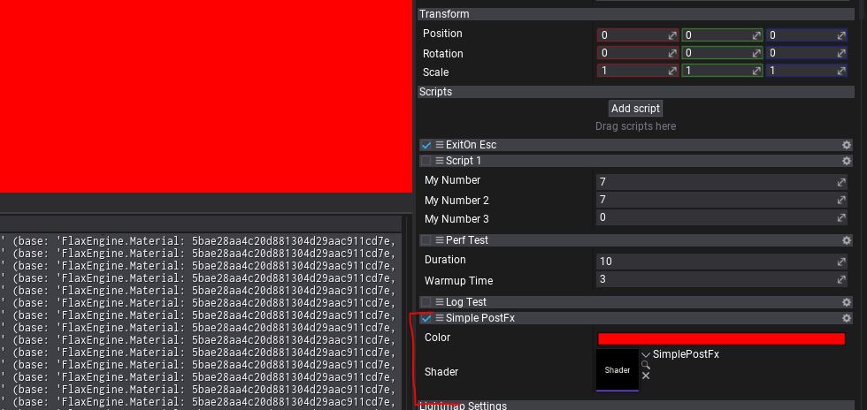
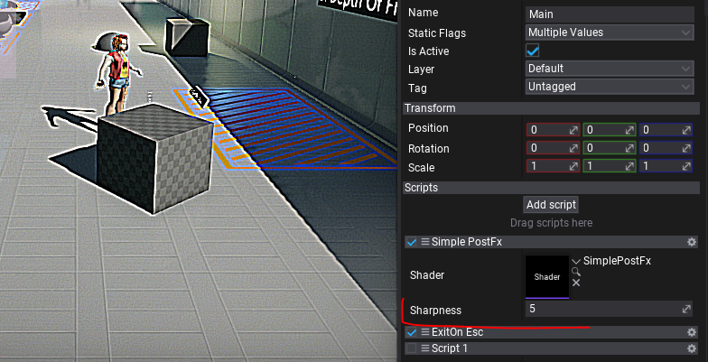

# Custom Fullscreen Shader

In this tutorial you will learn how to create and use a simple single-pass full screen effect that will use a Pixel Shader to apply post-process effect.

## 1. Create new shader

Firstly, create empty file in folder **Source/Shaders** and name it in a proper way, eg. `SimplePostFx.shader`. You can do it manually or use Editor and *right-click* in Content window shaders source folder **New -> Shader**.



If you're working with Visual Studio then use **File -> Generate project file** option to ensure new file was added to VS project. Then you can **double-click** to open shader in code editor.

As you can see the default generated shader contans:
* Copyright note based on project settings (if specified)
* Include directive that included the common types from Flax in-build shaders library
* Constant buffer declaration that contains a single *Color* variable
* Pixel Shader function named *PS_Fullscreen* that simply returns a solid color from constant buffer.



## 2. Using fullscreen shader

Now, before we write anything more advanced, we want to try-out the generated shader from the template to see it in action.

Create C# script and add it to the any actor on the scene. You can use [this tutorial](../../scripting/new-script.md) to learn how to do it. Then, write the following code:

```cs
public class SimplePostFx : PostProcessEffect
{
    private GPUPipelineState _psFullscreen;
    private Shader _shader;

    public Color Color = Color.Red;

    public Shader Shader
    {
        get => _shader;
        set
        {
            if (_shader != value)
            {
                _shader = value;
                ReleaseShader();
            }
        }
    }

    public override void OnEnable()
    {
#if FLAX_EDITOR
        // Register for asset reloading event and dispose resources that use shader
        Content.AssetReloading += OnAssetReloading;
#endif

        // Register postFx to game view
        MainRenderTask.Instance.CustomPostFx.Add(this);
    }

#if FLAX_EDITOR
    private void OnAssetReloading(Asset asset)
    {
        // Shader will be hot-reloaded
        if (asset == Shader)
            ReleaseShader();
    }
#endif

    public override void OnDisable()
    {
        // Remember to unregister from events and release created resources (it's gamedev, not webdev)
        MainRenderTask.Instance.CustomPostFx.Remove(this);
#if FLAX_EDITOR
        Content.AssetReloading -= OnAssetReloading;
#endif
        ReleaseShader();
    }

    private void ReleaseShader()
    {
        // Release resources using shader
        Destroy(ref _psFullscreen);
    }

    public override bool CanRender => base.CanRender && Shader && Shader.IsLoaded;

    public override unsafe void Render(GPUContext context, ref RenderContext renderContext, GPUTexture input, GPUTexture output)
    {
        // Here we perform custom rendering on top of the in-build drawing

        // Setup missing resources
        if (!_psFullscreen)
        {
            _psFullscreen = new GPUPipelineState();
            var desc = GPUPipelineState.Description.DefaultFullscreenTriangle;
            desc.PS = Shader.GPU.GetPS("PS_Fullscreen");
            _psFullscreen.Init(ref desc);
        }

        // Set constant buffer data (memory copy is used under the hood to copy raw data from CPU to GPU memory)
        var cb = Shader.GPU.GetCB(0);
        if (cb != IntPtr.Zero)
        {
            // When using more constants create structure with `StructLayout(LayoutKind.Sequential)` attribute and pass it's address to copy data
            fixed (Color* cbData = &Color)
                context.UpdateCB(cb, new IntPtr(cbData));
        }

        // Draw fullscreen triangle using custom Pixel Shader
        context.BindCB(0, cb);
        context.SetState(_psFullscreen);
        context.SetRenderTarget(output.View());
        context.DrawFullscreenTriangle();
    }
}
```

It overrides **PostProcessEffect** class which is used to inject custom rendering code into the in-build graphics pipeline. You can also override the *Order* and *Location* properties to have even more control over rendering.
As you can see, the script registers in `OnEnable` and disposes in `OnDisable`. Function `OnAssetReloading` handles shader hot-reloading in editor so it will be called once you edit your shader so it can be updated. The actual rendering is performed in `Render` method that gets GPU Context, Rendering Context and Input/Output textures to use for rendering.

Then **add script** to actor on scene and **assign Shader** property to the auto-imported shader source from `Content/Shaders`. Then you can adjust the color to see it changing live in the Game view.



## 3. Using textures

Final step is to perform the actual post-processing of the input image. To do so we need to bind the *input* texture to the shader and sample it with custom processing.

Here is the updated shader that implements **Sharpen** filter by sampling nearby pixels and blending with them:

```hlsl
#include "./Flax/Common.hlsl"

META_CB_BEGIN(0, Data)
float2 TexelSize;
float Sharpness;
float Dummy0;
META_CB_END

Texture2D Input : register(t0);

META_PS(true, FEATURE_LEVEL_ES2)
float4 PS_Fullscreen(Quad_VS2PS input) : SV_Target
{
	float2 uv = input.TexCoord;
	float2 step = TexelSize * 1.5f;
	float4 texA = Input.SampleLevel(SamplerLinearClamp, uv + float2(-step.x, -step.y), 0);
	float4 texB = Input.SampleLevel(SamplerLinearClamp, uv + float2( step.x, -step.y), 0);
	float4 texC = Input.SampleLevel(SamplerLinearClamp, uv + float2(-step.x,  step.y), 0);
	float4 texD = Input.SampleLevel(SamplerLinearClamp, uv + float2( step.x,  step.y), 0);

	float4 blur = 0.25 * (texA + texB + texC + texD);
	float4 original  = Input.SampleLevel(SamplerLinearClamp, uv, 0);

	return original + (original - blur) * Sharpness;
}
```

Now, let's modify the C# script to pass proper constants and texture for the shader.

Add the following code in the script class (eg. instead of the *Color* field).

```cs
/// <summary>
/// Shader constant buffer data structure that matches the HLSL source.
/// </summary>
[StructLayout(LayoutKind.Sequential)]
private struct Data
{
    public Float2 TexelSize;
    public float Sharpness;
    public float Dummy0;
}

[Tooltip("Sharpness effect intensity (0-10)"), Limit(0, 10, 0.1f)]
public float Sharpness = 5.0f;
```

Then modify rendering code:

```cs
// Set constant buffer data (memory copy is used under the hood to copy raw data from CPU to GPU memory)
var cb = Shader.GPU.GetCB(0);
if (cb != IntPtr.Zero)
{
    var data = new Data
    {
        TexelSize = Float2.One / input.Size,
        Sharpness = Sharpness,
    };
    context.UpdateCB(cb, new IntPtr(&data));
}

// Draw fullscreen triangle using custom Pixel Shader
context.BindCB(0, cb);
context.BindSR(0, input);
context.SetState(_psFullscreen);
context.SetRenderTarget(output.View());
context.DrawFullscreenTriangle();
```

As you can see the only changes are calling `UpdateCB` with our shader data structure and binding input texture to the shader pipeline with `BindSR` method.

## 4. See results

The final step is to test the results. When changing **Sharpness** property from 0 to 10 you can see the effect in action real-time. In case of problems see *Output Log* window in Editor as it may contain any compilation errors (for both C# script and shader code).


