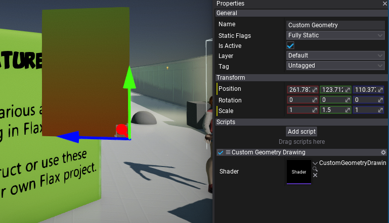

# Custom Geometry Drawing

In this tutorial you will learn how to implement custom geometry drawing. This technique allows to create custom geometry data, process it and display on a screen. It can be used to implement custom rendering for a game.

## 1. Create new shader

Firstly, create empty file in folder **Source/Shaders** and name it in a proper way, eg. `CustomGeometryDrawing.shader`. You can do it manually or use Editor and *right-click* in Content window shaders source folder **New -> Shader**.


If you're working with Visual Studio then use **File -> Generate project file** option to ensure new file was added to VS project. Then you can **double-click** to open shader in code editor.


## 2. Write Vertex and Pixel shaders

Now, we want to write a simple Vertex and Pixel shaders that will process our geometry and display it on a screen. To do so we first declare a constant buffer with object transformation (`WorldMatrix`) and camera+screen transformation (`ViewProjectionMatrix`). Those matrices are used to transform the vertex from model local-space to the world-space and then to the screen. This transformation is performed per-vertex in function `VS_Custom`. As you can see it gets `ModelInput` structure data as input (single vertex data) and outputs the processed vertex data in structure `VertexOutput`. Then, this data is processed by GPU which builds triangles, interpolates the triangles, performs the depth-test and calls the pixel shader function `PS_Custom` for every visible pixel on a screen. In this example we simple create a color gradient based on the pixel `WorldPoition.y` which is a location on Y axis of the pixel in the game world.

Also, note that vertex shader function contains a `META_VS_IN_ELEMENT(..)` attribute that informs the shader compiler and graphics pipeline backend that this function accepts the single RGB32 data as vertex position. If your ModelInput needs more data, remember to add the attributes there.

```hlsl
#include "./Flax/Common.hlsl"

META_CB_BEGIN(0, Data)
float4x4 WorldMatrix;
float4x4 ViewProjectionMatrix;
META_CB_END

// Geometry data passed to the vertex shader
struct ModelInput
{
    float3 Position : POSITION;
};

// Interpolants passed from the vertex shader
struct VertexOutput
{
    float4 Position : SV_Position;
    float3 WorldPosition : TEXCOORD0;
};

// Interpolants passed to the pixel shader
struct PixelInput
{
    float4 Position : SV_Position;
    float3 WorldPosition : TEXCOORD0;
};

// Vertex shader function for custom geometry processing
META_VS(true, FEATURE_LEVEL_ES2)
META_VS_IN_ELEMENT(POSITION, 0, R32G32B32_FLOAT, 0, 0, PER_VERTEX, 0, true)
VertexOutput VS_Custom(ModelInput input)
{
    VertexOutput output;
    output.WorldPosition = mul(float4(input.Position.xyz, 1), WorldMatrix).xyz;
    output.Position = mul(float4(output.WorldPosition.xyz, 1), ViewProjectionMatrix);
    return output;
}

// Pixel shader function for custom geoemtry drawing on a screen
META_PS(true, FEATURE_LEVEL_ES2)
float4 PS_Custom(PixelInput input) : SV_Target
{
    return lerp(float4(1, 0.1, 0, 1), float4(0.2, 0.9, 0.3, 1), frac(input.WorldPosition.y / 400));
}
```

## 3. Write rendering code

Next step is to create geometry buffers and render them with a custom shader.
Create C# script and add it to the any actor on the scene. You can use [this tutorial](../../scripting/new-script.md) to learn how to do it. Then, write the following code:

```cs
using System;
using System.Runtime.InteropServices;
using FlaxEngine;

public class CustomGeometryDrawing : PostProcessEffect
{
    /// <summary>
    /// Shader constant buffer data structure that matches the HLSL source.
    /// </summary>
    [StructLayout(LayoutKind.Sequential)]
    private struct Data
    {
        public Matrix WorldMatrix;
        public Matrix ViewProjectionMatrix;
    }

    private static readonly Vector3[] _vertices =
    {
        new Vector3(0, 0, 0),
        new Vector3(100, 0, 0),
        new Vector3(100, 100, 0),
        new Vector3(0, 100, 0),
        new Vector3(0, 100, 100),
        new Vector3(100, 100, 100),
        new Vector3(100, 0, 100),
        new Vector3(0, 0, 100),
    };

    private static readonly uint[] _triangles =
    {
        0, 2, 1, // Face front
        0, 3, 2,
        2, 3, 4, // Face top
        2, 4, 5,
        1, 2, 5, // Face right
        1, 5, 6,
        0, 7, 4, // Face left
        0, 4, 3,
        5, 4, 7, // Face back
        5, 7, 6,
        0, 6, 7, // Face bottom
        0, 1, 6
    };

    private GPUBuffer _vertexBuffer;
    private GPUBuffer _indexBuffer;
    private GPUPipelineState _psCustom;
    private Shader _shader;

    public Shader Shader
    {
        get => _shader;
        set
        {
            if (_shader != value)
            {
                _shader = value;
                ReleaseShader();
            }
        }
    }

    public override unsafe void OnEnable()
    {
        // Create vertex buffer for custom geometry drawing
        _vertexBuffer = new GPUBuffer();
        fixed (Vector3* ptr = _vertices)
        {
            var desc = GPUBufferDescription.Vertex(sizeof(Vector3), _vertices.Length, new IntPtr(ptr));
            _vertexBuffer.Init(ref desc);
        }

        // Create index buffer for custom geometry drawing
        _indexBuffer = new GPUBuffer();
        fixed (uint* ptr = _triangles)
        {
            var desc = GPUBufferDescription.Index(sizeof(uint), _triangles.Length, new IntPtr(ptr));
            _indexBuffer.Init(ref desc);
        }

#if FLAX_EDITOR
        // Register for asset reloading event and dispose resources that use shader
        Content.AssetReloading += OnAssetReloading;
#endif

        // Register postFx to all game views (including editor)
        SceneRenderTask.GlobalCustomPostFx.Add(this);
    }

#if FLAX_EDITOR
    private void OnAssetReloading(Asset asset)
    {
        // Shader will be hot-reloaded
        if (asset == Shader)
            ReleaseShader();
    }
#endif

    public override void OnDisable()
    {
        // Remember to unregister from events and release created resources (it's gamedev, not webdev)
        SceneRenderTask.GlobalCustomPostFx.Remove(this);
#if FLAX_EDITOR
        Content.AssetReloading -= OnAssetReloading;
#endif
        ReleaseShader();
        Destroy(ref _vertexBuffer);
        Destroy(ref _indexBuffer);
    }

    private void ReleaseShader()
    {
        // Release resources using shader
        Destroy(ref _psCustom);
    }

    public override bool CanRender => base.CanRender && Shader && Shader.IsLoaded;

    public override bool UseSingleTarget => true; // This postfx overdraws the input buffer without using output

    public override PostProcessEffectLocation Location => PostProcessEffectLocation.BeforeForwardPass;

    public override unsafe void Render(GPUContext context, ref RenderContext renderContext, GPUTexture input, GPUTexture output)
    {
        // Here we perform custom rendering on top of the in-build drawing

        // Setup missing resources
        if (!_psCustom)
        {
            _psCustom = new GPUPipelineState();
            var desc = GPUPipelineState.Description.Default;
            desc.VS = Shader.GPU.GetVS("VS_Custom");
            desc.PS = Shader.GPU.GetPS("PS_Custom");
            _psCustom.Init(ref desc);
        }

        // Set constant buffer data (memory copy is used under the hood to copy raw data from CPU to GPU memory)
        var cb = Shader.GPU.GetCB(0);
        if (cb != IntPtr.Zero)
        {
            var data = new Data();
            Matrix.Multiply(ref renderContext.View.View, ref renderContext.View.Projection, out var viewProjection);
            Actor.GetLocalToWorldMatrix(out var world);
            Matrix.Transpose(ref world, out data.WorldMatrix);
            Matrix.Transpose(ref viewProjection, out data.ViewProjectionMatrix);
            context.UpdateCB(cb, new IntPtr(&data));
        }

        // Draw geometry using custom Pixel Shader and Vertex Shader
        context.BindCB(0, cb);
        context.BindIB(_indexBuffer);
        context.BindVB(new[] {_vertexBuffer});
        context.SetState(_psCustom);
        context.SetRenderTarget(renderContext.Buffers.DepthBuffer.View(), input.View());
        context.DrawIndexed((uint)_triangles.Length);
    }
}
```

It overrides **PostProcessEffect** class which is used to inject custom rendering code into the in-build graphics pipeline.
As you can see, the script registers in `OnEnable` and disposes in `OnDisable`. Function `OnAssetReloading` handles shader hot-reloading in editor so it will be called once you edit your shader so it can be updated. The actual rendering is performed in `Render` method that gets GPU Context, Rendering Context and Input/Output textures to use for rendering.

Then **add script** to actor on scene and **assign Shader** property to the auto-imported shader source from `Content/Shaders`.

## 4. See results

Once you setup shader, script and add it to the scene you should be able to see in both Editor and Game viewports the rendered custom model. In case of problems see *Output Log* window in Editor as it may contain any compilation errors (for both C# script and shader code).


