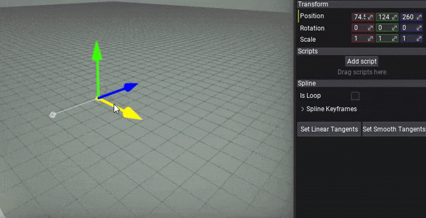
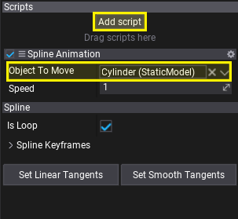
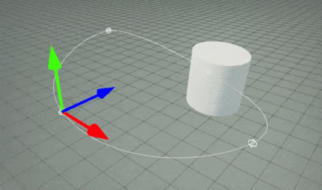

# HOWTO: Animate object over spline

In the following tutorial, you will learn how to move an object over the spline.

## Tutorial

### 1. Create spline

Follow [this](index.md) tutorial. Alternatively, set it to **Loop** to have continuous animation.



### 2. Create script

Follow [scripting documentation](../../scripting/index.md) about creating new scripts and make a new script named **SplineAnimation** and write the following contents:

```cs
using System;
using FlaxEngine;

public class SplineAnimation : Script
{
    private float _time;
    private Spline _spline;

    [Tooltip("The speed of the object animation over the spline.")]
    public float Speed = 1.0f;

    [Tooltip("The actor to move it over the spline.")]
    public Actor ObjectToMove;

    public override void OnEnable()
    {
        // Cache spline actor
        _spline = Actor.As<Spline>();
        if (!_spline)
            throw new Exception("Attach script to a spline.");
    }

    public override void OnUpdate()
    {
        if (!_spline || !ObjectToMove)
            return;

        // Update position
        _time += Time.DeltaTime * Speed;

        // Evaluate the spline curve
        var direction = _spline.GetSplineDirection(_time);
        var transform = _spline.GetSplineTransform(_time);

        // Place object on the spline and make it oriented along the spline direction
        transform.Orientation = Quaternion.LookRotation(direction, Vector3.Up) * transform.Orientation;
        ObjectToMove.Transform = transform;
    }
}
```

### 3. Setup

Select Spline and click **Add script** button. Then pick your new script to attach it to the spline.
Finally, choose the actor to move over the spline by setting **Object To Move** property on the script.



### 4. Test it out!

Now, hit *play* button and see the object moving along the spline. You can even edit spline while it moves over it.



