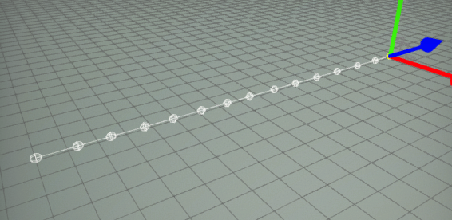
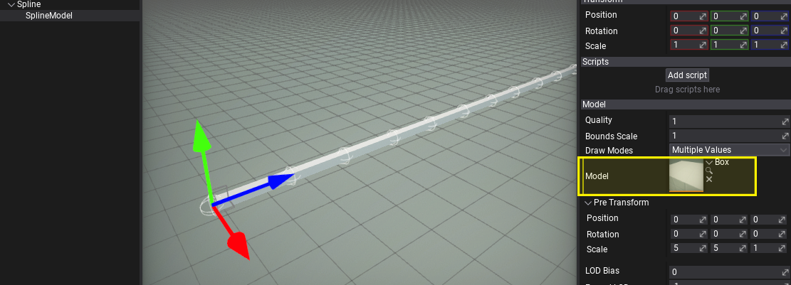
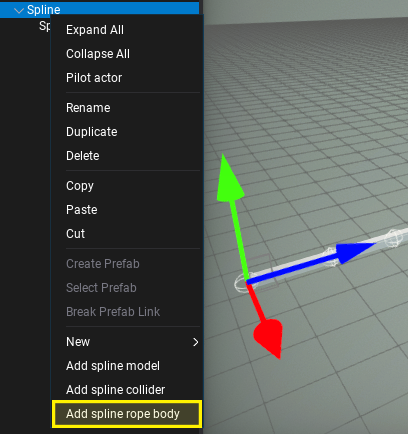
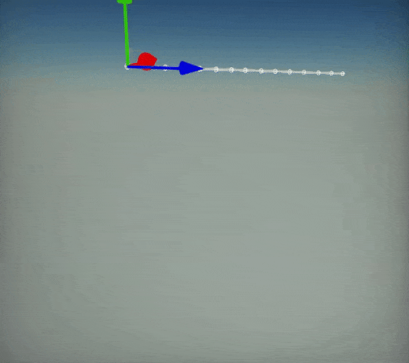
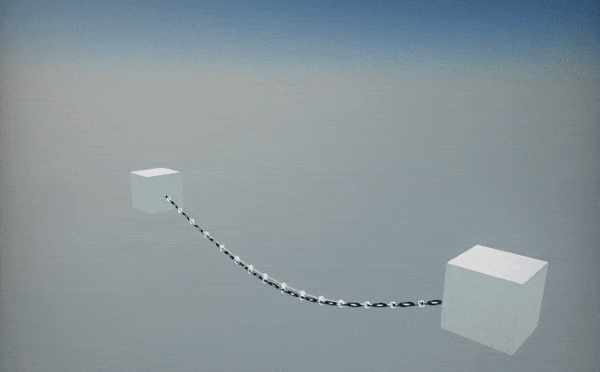

# HOWTO: Create dynamic chain from spline

In the following tutorial, you will learn how to create dynamic chain/rope/cable with physics using spline components.

## Tutorial

### 1. Create spline

Follow [this](index.md) tutorial and create a simple spline with a series of approx. 6-15 points placed evenly over the line.

### 2. Add model to spline

*Right-click* on spline actor in *Scene* window and select option **Add spline mode**. This will create a spline model rendering actor as a child to a spline. It will draw a model between the spline segments. In this example it will be used to draw chain segments.

Then, set the model you want to draw over the spline. You can use one of the in-build primitives, such as a box or cylinder if you don't have your own chain/rope/cable model. Also, remember to use **Pre Transform** property to adjust the model rotation, scale and translation to the spline so it will look as desired.

If you want to use custom material for the spline model ensure to use **material domain** set to **Deformable**. It uses a special shader to deform mesh over the spline curve. Also, it supports tessellation to improve model geometry for highly bent meshes.

### 3. Add rope body to spline

*Right-click* again on spline actor in *Scene* window and select option **Add spline rope body**. This actor when added to Spline as a child runs physical simulation over that spline points. The result is highly efficient rope simulation which can be used on cables, chains, and cables in the level to add more dynamism to them.

Feel free to adjust rope body properties such as gravity scale or other simulation settings. You can also make the spline endpoint attached to other actors which will make chain both tips constrained.

### 4. Test it out!

Now, hit *play* button and see the spline behaving like a chain, even if you move it around the scene.

Here is an example of chain between two objects:

