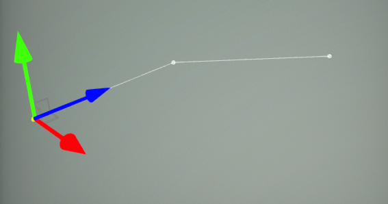
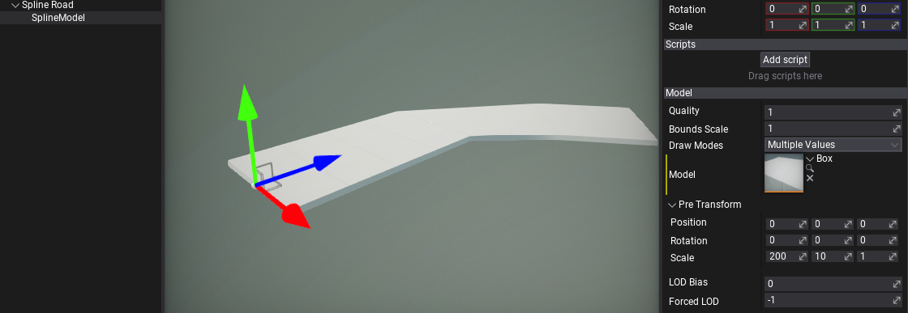
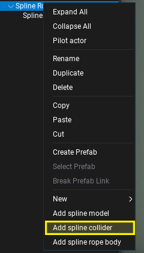
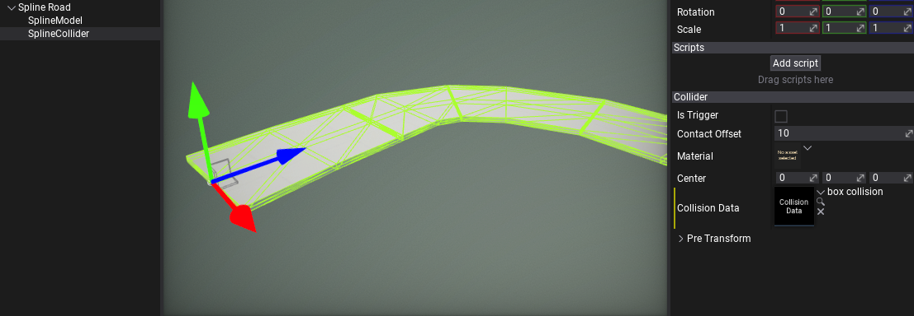
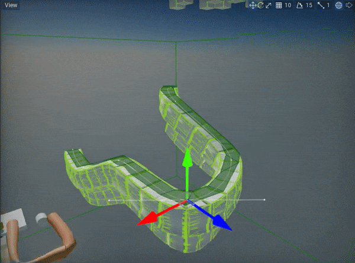

# HOWTO: Create road from spline

In the following tutorial, you will learn how to create road in the level with collision using spline components.

## Tutorial

### 1. Create spline

Follow [this](index.md) tutorial and create a simple spline.

### 2. Add model to spline

*Right-click* on spline actor in *Scene* window and select option **Add spline mode**. This will create a spline model rendering actor as a child to a spline. It will draw a model between the spline segments. In this example it will be used to draw road segments.

Then, set the model you want to draw over the spline. You can use one of the in-build primitives, such as a box if you don't have your own road model. Also, remember to use **Pre Transform** property to adjust the model rotation, scale and translation to the spline so it will look as desired.

If you want to use custom material for the spline model ensure to use **material domain** set to **Deformable**. It uses a special shader to deform mesh over the spline curve. Also, it supports tessellation to improve model geometry for highly bent meshes.

### 3. Add collision to spline

*Right-click* again on spline actor in *Scene* window and select option **Add spline collider**. This actor when added to Spline as a child creates a statoc collider over that spline points. Ensure to assin the **Collision Data** to the created collider that matches the object mesh (can be convex or triangle mesh using lower LOD for better performance).

Feel free to adjust rope body properties such as gravity scale or other simulation settings. You can also make the spline endpoint attached to other actors which will make chain both tips constrained.

### 4. It works!

As a final result, the road will have proper collision and model drawing. You can easily arrange the road over the level or terrain. The same technique can be used for rivers or rails. Also, the spline collider supports generating navmesh so AI can walk over it.

