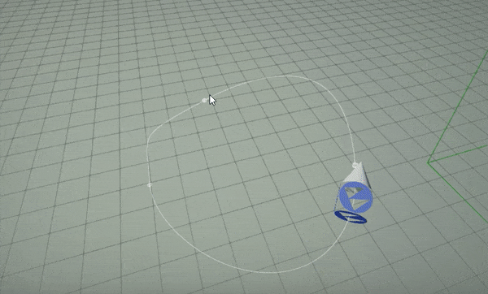
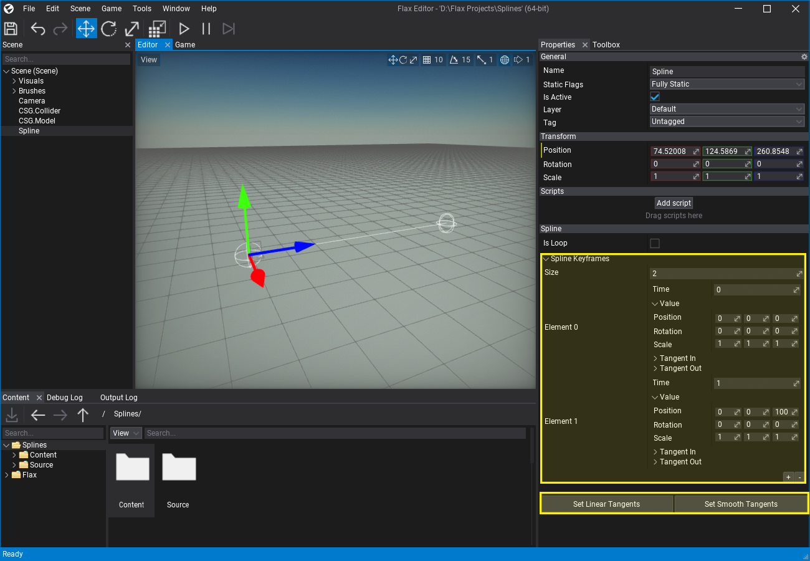
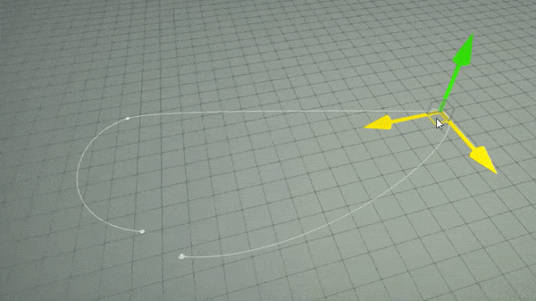

# Splines


**Splines** are shape actors that define spatial curves with utility functions for general purpose usage. They are a great tool for creating levels and game play components such as rail tracks, rivers, ropes, chains, stairs and so on.

A spline is defined by **bezier curve** points represented as series of transformations in 3D space (with tangents). Points are stored in the local-space of the actor. A spline contains a wide scripting API for curve evaluation for procedural objects placement or any other game play logic use cases. For instance, you can easily animate an object to fly over the spline as shown below.

To learn more about splines follow the dedicated tutorials in this section.



## In this section

* [How to animate object over spline](animate-object.md)
* [How to create road from spline](create-road.md)
* [How to create dynamic chain from spline](create-chain.md)

## How to create spline?

To add a spline to your scene simply *drag&drop* from the *Toolbox* window into the level viewport or use *right-click* and select option **New -> Other -> Spline**.



After selecting the newely created spline, the *Properties* window will display the selected spline's settings keyframes list. It can be used to manually edit the Bezier curve (the value and both tangents per point). You can also use the utility buttons to adjust the curves at the curve tagent points to have a linear or smooth shape (automatic tangents calculation). Splines support looping which automatically synchronizes the last spline curve point with the first one to make a loop.

The editor supports selecting spline points in the level editor and using a gizmo to transform them. After selecting a point it will display its tangent points which can be edited too. You can quickly create curves in the level with the gizmo and holding the *Shift* key to insert new points.



## How to create a spline from code?

Spline actors have a very rich scripting API and support dynamic generation at runtime from code. The following example script spawns a spline and creates a few points over it.

```cs
var spline = new Spline
{
    Name = "My Spline",
};
spline.AddSplineLocalPoint(new Vector3(0, 0, 0), false);
spline.AddSplineLocalPoint(new Vector3(0, 0, 500), false);
spline.AddSplineLocalPoint(new Vector3(0, 400, 700), false);
spline.SetTangentsSmooth();
Level.SpawnActor(spline);
```
