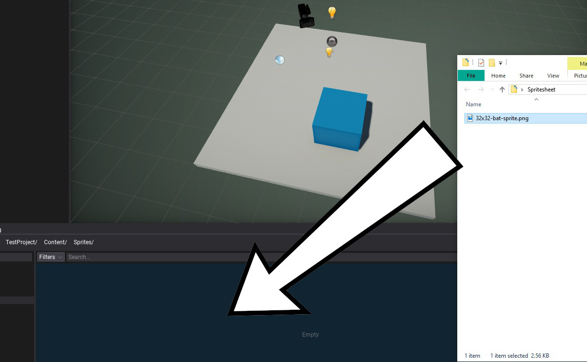
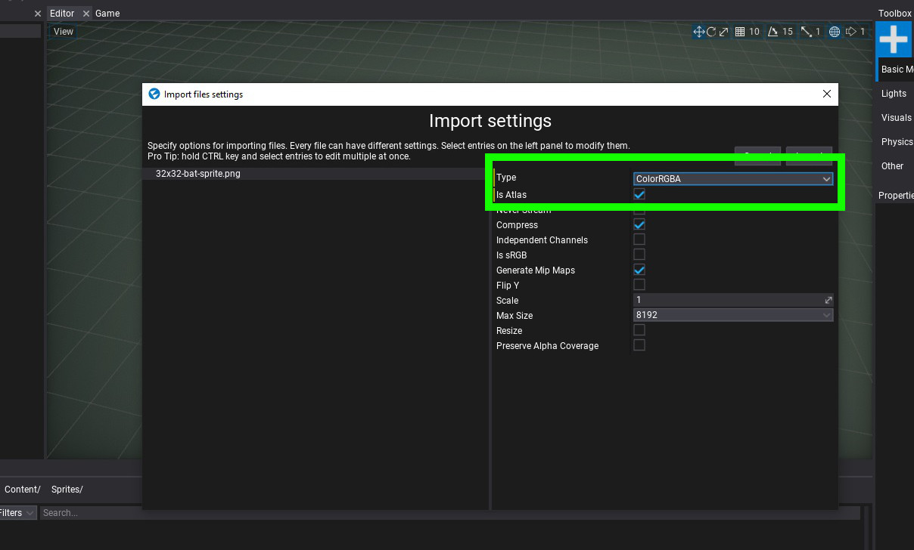
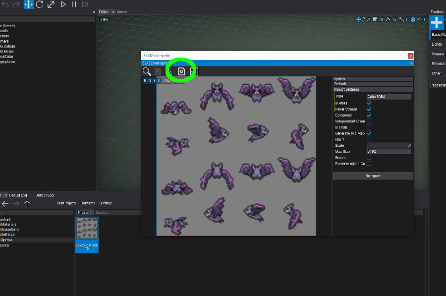
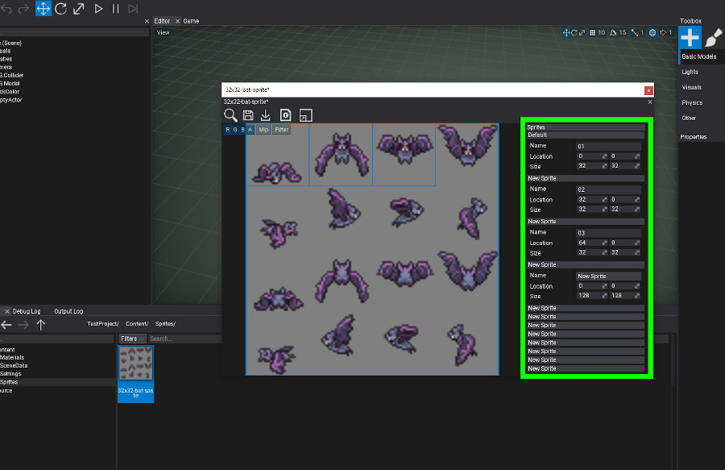
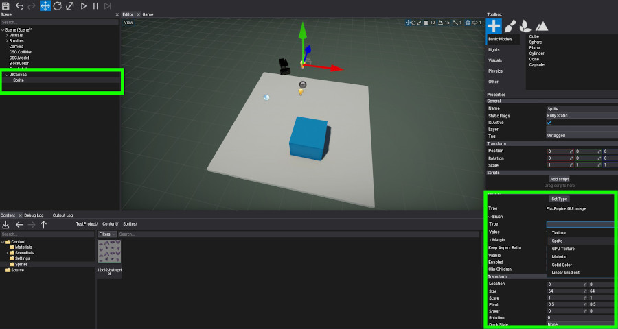
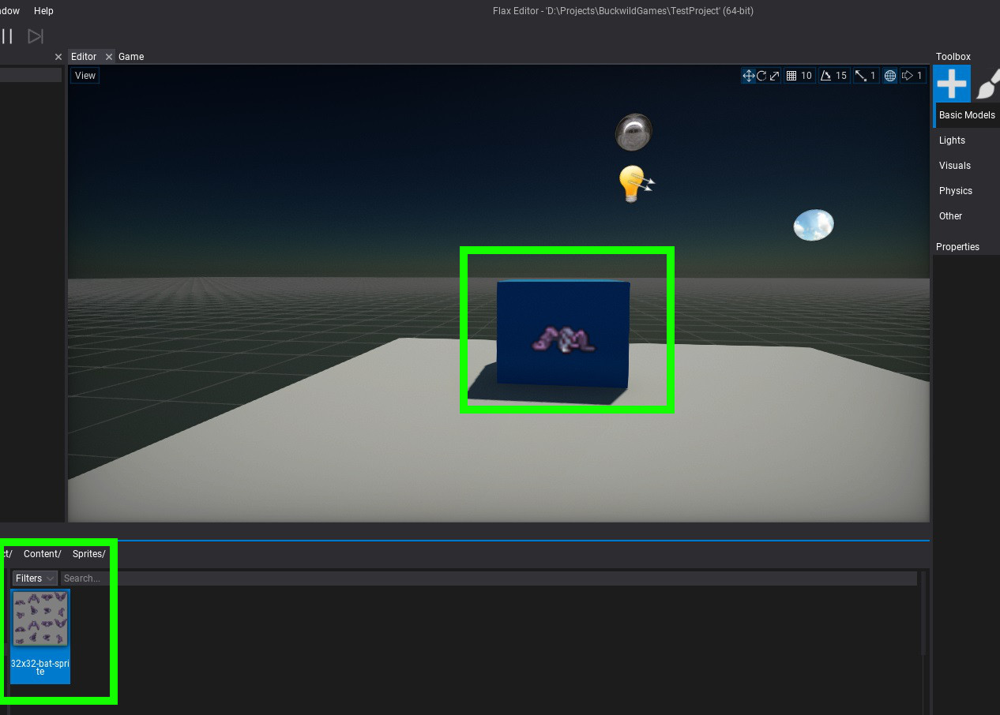

# Sprites

**Sprites** are assets that contain an image comprised of pixel data. They are mainly used for GUI implementation and can be animated. A sprite can be a singular image or an image composed of multiple frames. When a sprite contains multiple images or frames it is known as a sprite atlas.

Flax Engine supports importing the following list of file types as sprites:
- `.png`
- `.jpg`
- `.jpeg`
- `.bmp`
- `.gif`
- `.tga`
- `.tif`
- `.tiff`
- `.dds`
- `.hdr`
- `.raw`

## Importing a Sprite

The easiest way to import one or more sprites is to drag them from *Explorer* to the *Content* window.

Alternatively, you can use **Import** button in a *Content* window toolbar and then select files to import.

After choosing the files **Import file settings** dialog shows up. It's used to specify import options per sprite. In most cases the default values are fine and you can just press the **Import** button.

After importing a sprite you will be prompted with a dialogue box for import settings. If this sprite is a sprite atlas, you will need to select the **Is Atlas** option. Additionally, if you wish to import the sprite with transparencies intact, for example from a .png, select the **RBGA** option to include the Alpha channel in the import. After importing the sprite, Flax Editor will convert the sprite to binaries.

The sprite should now be imported.

## Modifying a Sprite Atlas

A sprite atlas refers to both the sprite and frame data. Currently frame data can be entered in one of two ways. One method is to enter frame location and size values after clicking the add frame "+" button. Once a frame has been added you can enter location and size values on the right-side navigation. Another method for adding a frame to the atlas is through code, the API reference is [here](https://docs.flaxengine.com/api/FlaxEngine.SpriteAtlas.html#FlaxEngine_SpriteAtlas_AddSprite).

In the below image the add frame "+" button has been clicked a number of times and frame data values are being input.

After all the frame data is input you are ready to add the sprite to the scene. Right click on a UI canvas to add a UI Control for an image sprite and configure Image values in the properties view. Another way to add the sprite to the scene is to simply drag the sprite into the scene heiarchy. You can modify which frame of the sprite is depicted in the properties window.

> [!Note]
> Future versions of Flax Editor will provide for automtaic creation of the sprite atlas from different sprite sheets.

The sprite is now ready for use or animation.

