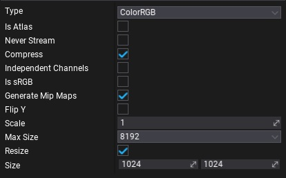

# Texture Import Settings

| Property | Description |
|--------|--------|
| **Type** | Specifies the texture data type. In certain cases a texture may not have an alpha channel or contain very specific data so during importing and compressing, the texture may be processed in a specific way. Possible options: <table><tbody><tr><th>Option</th><th>Description</th></tr><tr><td>**ColorRGB**</td><td>Color texture. Uses `RGB` channels. Recommended for diffuse maps.</td></tr><tr><td>**ColorRGBA**</td><td>Color texture with alpha. Uses `RGBA` channels. Recommended for transparent materials albedo or wires/chains materials. The additional alpha channel can contain a packed surface roughness value to reduce the number of textures.</td></tr><tr><td>**NormalMap**</td><td>Normal map texture. Recommended for all tangent space normal maps.</td></tr><tr><td>**GrayScale**</td><td>Grayscale texture. Uses the `R` channel. Recommended for roughness/specular/height/occlusion maps.</td></tr><tr><td>**HdrRGBA**</td><td>HDR color tetxture with alpha. Uses `RGBA` channels. Recommended for emission maps or other custom usage.</td></tr><tr><td>**HdrRGB**</td><td>HDR color tetxture. Uses `RGB` channels. Recommended for sky textures or emission maps.</td></tr></tbody></table>|
| **Is Atlas** | If checked, the texture will be imported as a texture atlas (with sprites). |
| **Never Stream** | If checked, dynamic resource streaming will be disabled for this texture. |
| **Compress** | If checked, texture data will be comrpessed to use less memory. |
| **Independent Channels** | If checked, texture channels have independent data (used for compression methods). Should be used for masks or packed textures.|
| **sRGB** | If checked, texture contains colors in sRGB format data. |
| **Generate Mip Maps** | If checked, full mip maps chain will be generated for the texture. |
| **Flip Y** | If checked, texture Y coordinate will be flipped. |
| **Scale** | Custom scale parameter. Allows increasing or decresing the imported texture resolution. The default value is 1. |
| **Max Size** | The maximum size of the imported texture. Used to clip textures that are too big. |
| **Resize** | If checked, the importer will resize the texture. Use the Size property to define the texture's width and height. The texture scale property will be ignored. |
| **Size** | The size of the imported texture. If the *Resize* property is checked then the texture will be resized to this value during the import, otherwise it will be ignored. |
| **Preserve Alpha Coverage** | Check to preserve the alpha coverage in generated mips for alpha test reference. Scales the mipmap alpha values to preserve alpha coverage based on an alpha test reference value. |
| **Preserve Alpha Coverage Reference** | The reference value for the alpha coverage preservation. Used only if *Preserve Alpha Coverage* is checked. |
| **Texture Group** | The texture group for streaming (optional). See [Texture Groups](texture-groups.md). |
