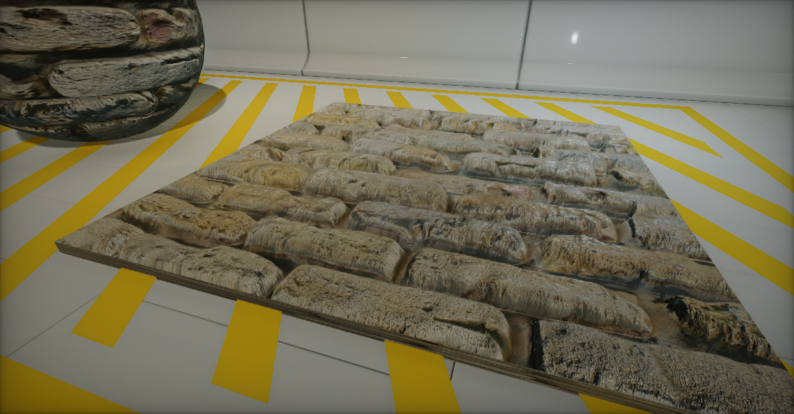
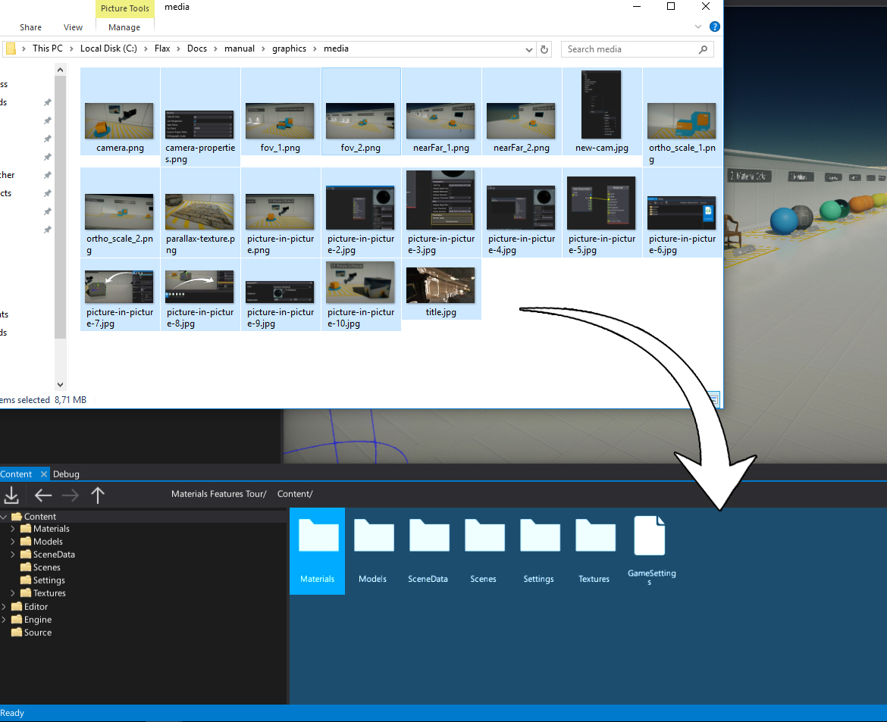
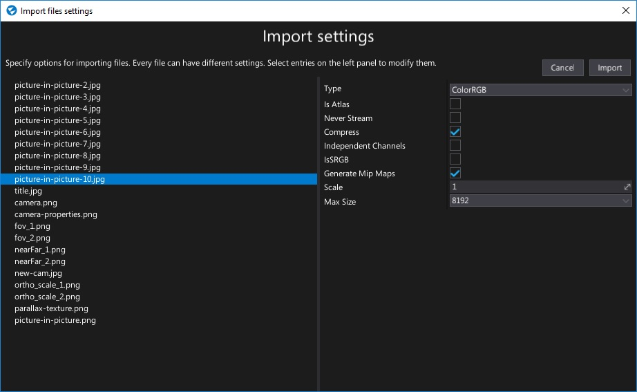
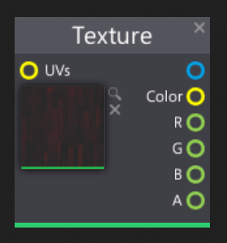

# Textures

**Textures** are assets that contain an image made of pixel-data. They are mainly used in materials to cover the surfaces.

For example, texture can contain color information or material roughness variation so using it in material shader adds more realism.

Textures can be also used outside the materials. For instance in UI or via direct CPU calculations. For more information about the C# scripting see [Texture](http://docs.flaxengine.com/api/FlaxEngine.Texture.html) class page in the C# API documentation.

## Supported file type

Flax Engine supports importing the following list of file types as textures:
- `.png`
- `.jpg`
- `.jpeg`
- `.bmp`
- `.gif`
- `.tga`
- `.tif`
- `.tiff`

> [!Note]
> Flax imports only the first frame of animated image files, such as animated gifs or PNGs. They don't animate in Flax; they appear as static images.

## Importing a texture

The easiest way to import one or more textures is to drag them from *Explorer* to the *Content* window.

Alternatively, you can use **Import** button in a *Content* window toolbar and then select files to import.

After choosing the files **Import file settings** dialog shows up. It's used to specify import options per texture. In most cases the default values are fine and you can just press the **Import** button.

> [!Note]
> * Flax automaticly detects imported texture type based on it's name. For instance: *Chair_Normal.png* will be detected as a normal map and *Chair_AO.png* will be detected as a grayscale texture (as it contains single channel ambient occlusion data).
> * Using **Import file settings** dialog you can select more than one texture at once (or use **Ctrl+A** to select all) and specify import options at once.

Every texture can be reimport (relative path to the source file is cached) and import settings modified using [Texture Window](texture-window.md).

For more information about textures import settings read dedicated documenation page [Textures Import Settings](import-settings.md).

## Using textures

To use your texture asset in a material simply drag and drop it into the material surface graph and use *Texture* node for sampling it.

To learn more about materials and using textures for rendering go to [Materials Basics](../materials/basics/index.md) page.

