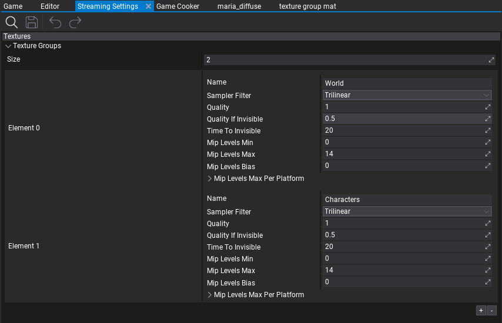
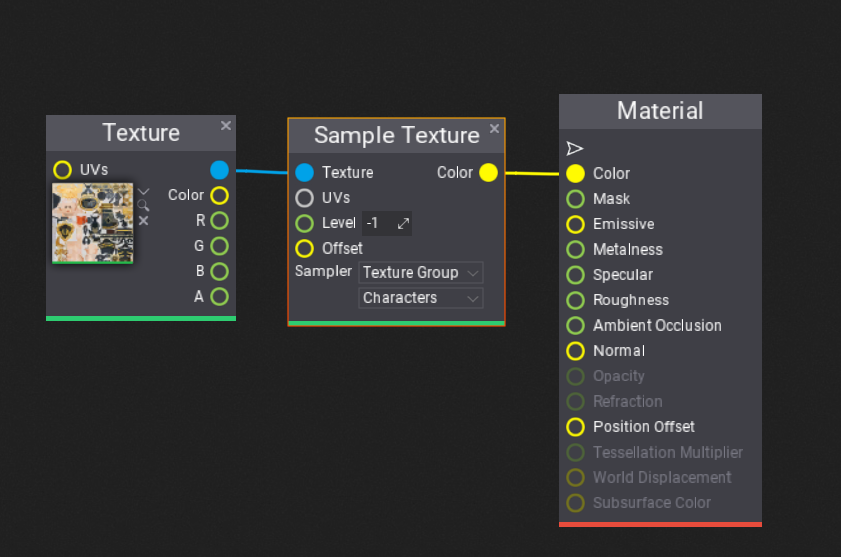

# Texture Groups

**Texture Groups** are an engine feature that allows grouping a set of texture resources together and using a shared configuration for them. For example, textures used for terrain (diffuse maps, normal maps, etc.) can be grouped together to use custom configuration for streaming, sampling and quality reduction. This helps organize the game content in larger projects.

Texture Groups can be used to control textures quality, streaming speed and quality reduction for invisible textures. You can also define the textures resolution stripping per-platform to reduce game build size and increase performance for mobile or low-end platforms. Finally, texture groups can be used to control dynamic textures quality for PC games to match game performance to GPU performance and memory avaliable (textures quality and sampling options).

Follow this documentation section to learn how to use Texture Groups.

## Texture Group Setup

The first step is to create a new *Streaming Settings* asset (or use an existing one). To learn how to do it see this [tutorial](../../editor/game-settings/index.md).
Ensure the Streaming settings asset is set in *Game Settings*.

Then, add the first texture group to the list. Each texture group contains several properties that can be modified at runtime (eg. from game scripts). Ensure to **preserve the order of groups** as assets reference groups by index (rather than by *Name*).

To assign a texture to a particual Texture Group use the [Texture Window](texture-window.md) editor (*Properties* group) or assign it when [importing new textures](import-settings.md). Use a texture group picker that shows the list of texture groups in a project. For very specific scenarios you can also change the texture group from scripts at runtime.

## Properties

| Property | Description |
|--------|--------|
| **Name** | The name of the group (for developers to identify the group). |
| **Sampler Filter** | The default filtering method for samplers using this texture group. Possible options: <table><tbody><tr><th>Option</th><th>Description</th></tr><tr><td>**Point**</td><td>Filter using the nearest found pixel. The texture appears pixelated.</td></tr><tr><td>**Bilinear**</td><td>Filter using the linear average of the nearby pixels. The texture appears blurry.</td></tr><tr><td>**Trilinear**</td><td>Filter using the linear average of the nearby pixels and nearby mipmaps. The texture appears blurry.</td></tr><tr><td>**Anisotropic**</td><td>Filter using the anisotropic filtering that improves quality when viewing textures at steep angles. The texture appears sharp at extreme viewing angles.</td></tr></tbody></table> |
| **Max Anisotropy** | The maximum number of samples that can be used to improve the quality of sample footprints that are anisotropic. Higher values improve texturing but reduce performance. Limited by GPU capabilities and used only if SamplerFilter is Anisotropic. |
| **Quality** | The quality scale factor applied to textures in this group. Can be used to increase or decrease textures resolution. In the range 0-1 where 0 means lowest quality, 1 means full quality. |
| **Quality If Invisible** | The quality scale factor applied when the texture is invisible for some time (defined by TimeToInvisible). Used to decrease texture quality when it's not rendered. |
| **Time To Invisible** | The time (in seconds) after which the texture is considered to be invisible (if it's not rendered by a certain amount of time). |
| **Mip Levels Min** | The minimum amount of loaded mip levels for textures in this group. Defines the amount of the mips that should be always loaded. Higher values decrease streaming usage and keep more mips loaded. |
| **Mip Levels Max** | The maximum amount of loaded mip levels for textures in this group. Defines the maximum amount of mips that can be loaded. Overriden per-platform. Lower values reduce texture quality and improve performance. |
| **Mip Levels Bias** | The loaded mip levels bias for textures in this group. Can be used to increase or decrease the quality of streaming for textures in this group (eg. bump up the quality during cinematic sequence). |
| **Mip Levels Max Per Platform** | The per-platform maximum amount of mip levels for textures in this group. Can be used to strip textures quality when cooking the game for a target platform (editor-only). |

## Textures Streaming Quality

Flax by default streams all loaded textures to the highest available quality. However, larger scenes require move advanced configuration and streaming budget. By using Texture Group settings and assigning certain textures to a specific group you can control global textures quality and define quality when a texture is not rendered (invisible).

You can preview Texture Group settings live in the Editor via **Graphics Quality window**. The example gif below shows the dynamic textures quality change.

## Textures Sampling

By default, materials use the **Trilinear Wrap** sampler when texturing objects. For a custom sampler use the **Sample Texture** node in a material that contains an option to select another sampler or use **sampler from texture gropup** (select Texture Group as sampler and pick a texture group to use). Then the *Sampler Filter* and *Anisotropy* properties will be used to pass the sampler to the GPU shader. Those properties can be changed at runtime too (eg. to increase texture quality during cutscenes or manually from game main menu).

## Textures Quality Per-Platform

When creating a cross-platform game you might want to reduce texture quality for a certain platform such as: Android or Switch. To do that use the *Mip Levels Max Per Platform* property that allows defining a maximum amount of mip levels for a target platform (per texture group). For instance, adding an entry for *Android* with a value of *10* will limit texture quality of a given group to 10 mips, which limits textures resoltuion to 1024 pixels (width or height). This will be applied when cooking the game so the final build will be smaller and run faster.
