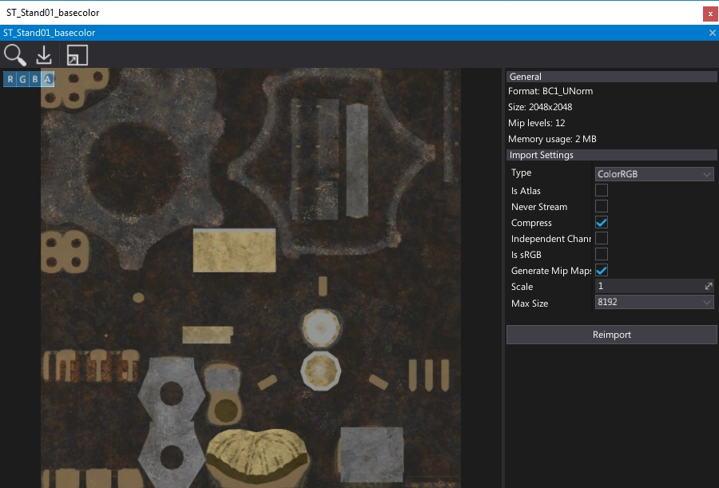
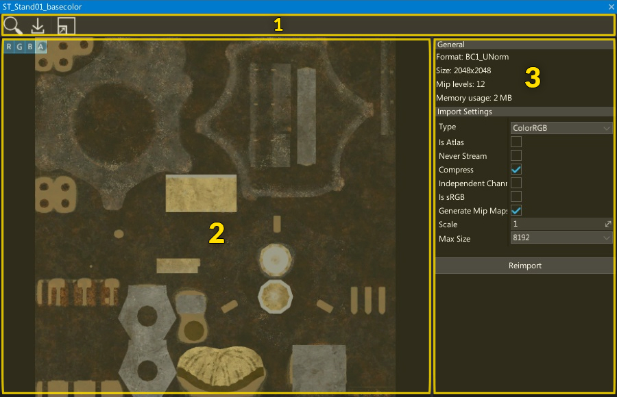
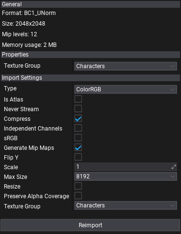

# Texture Window

**Texture Window** is the main tool to preview and reimport texture assets. To show it simply double-click on a texture in a *Content* window.

## Interface

The texture window UI consists of a toolstrip, viewport and properties panel.

1. Toolstrip
2. Viewport
3. Properties Panel

### Toolstrip

The following table lists the options in the toolstrip and what they do.

| Icon | Description |
|--------|--------|
|  | Shows and selects the asset in the *Content* window |
|  | Reimports texture |
|  | Shows the whole material graph on the surface |

### Viewport

The viewport panel shows the preview of the texture. You can navigate in the viewport by using the **mouse buttons** or zoom in/out using **mouse scroll wheel**.

In the upper left corner the viewport contains a widget buttons. By pressing `R/G/B/A` buttons you can toggle texture channels visibility. This is useful for debugging mask textures contents. You can also use buttons for changing the texture filtering in the preview between *Point* and *Linear*. Also, **Mip** button can be used to preview any texture mip map contents.

### Properties panel

This panel shows texture info and settings.

- **General** group contains information about texture data format, size and memory usage.
- **Properties** group contains texture options to adjust (ensure to save asset after editing).
- **Import Settings** group contains texture import options (restored from last import). You can modify them and press **Reimport** button to update the asset from the source image file

To learn more about texture import options see dedicated [Texture Import Settings](import-settings.md) page.
