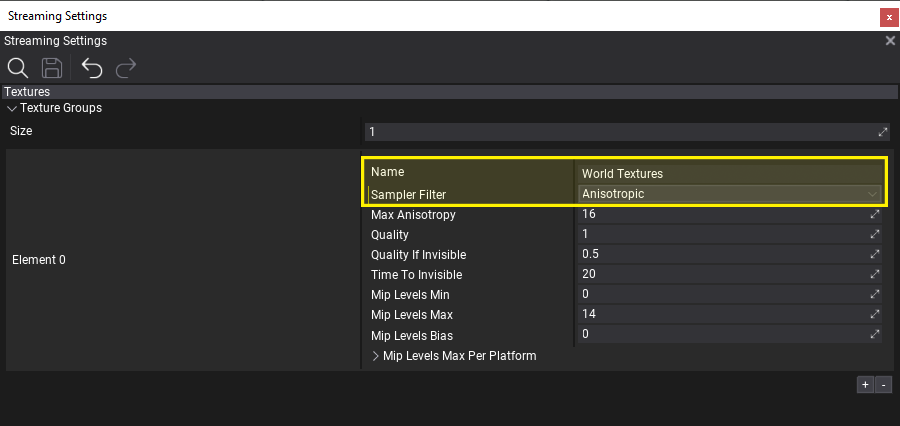
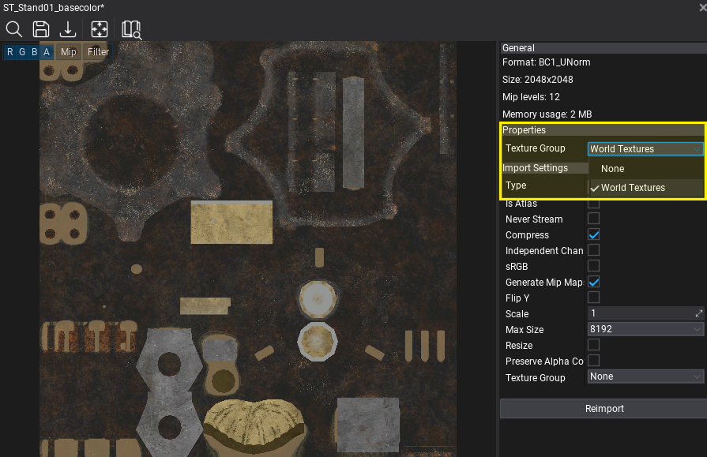
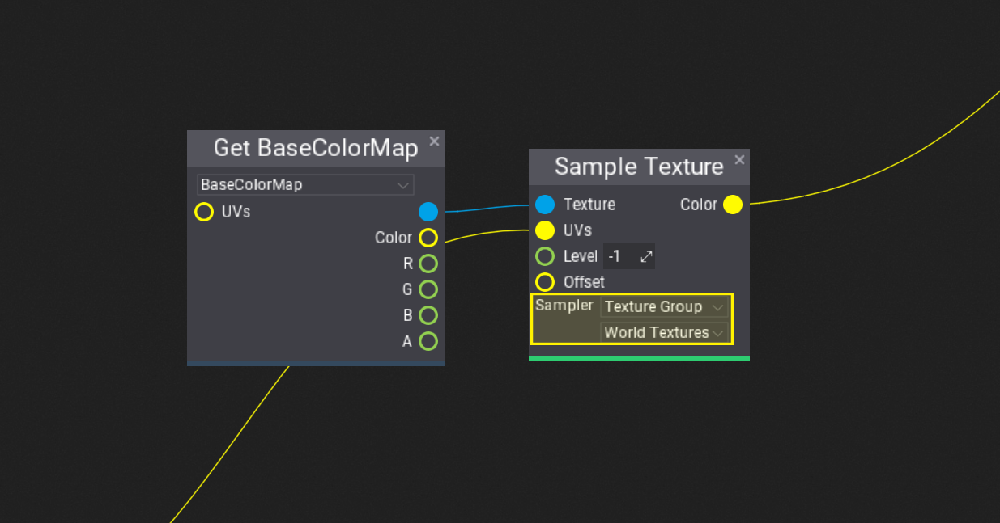
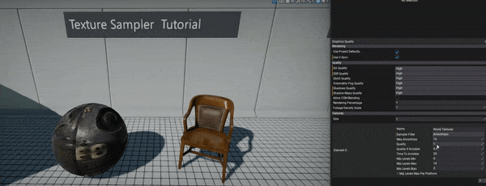
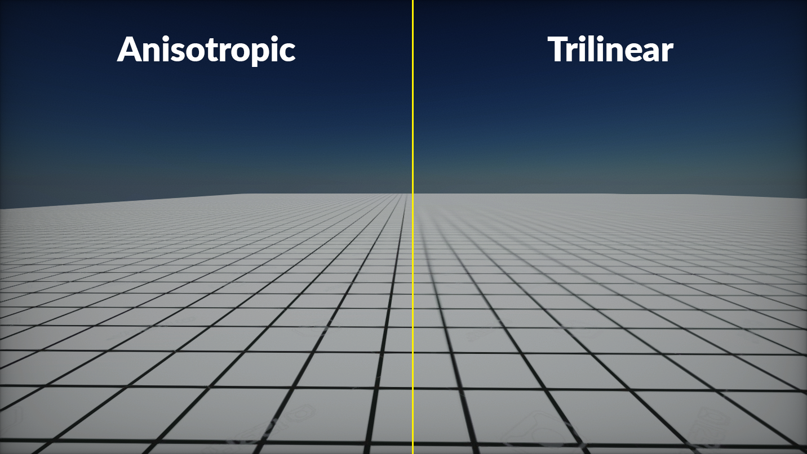

# HOWTO: Use anisotropic texture sampler

In this tutorial you will learn how to create [Texture Group](../textures/texture-groups.md) and use it to sample textures with anisotropic filtering. You can use different filtering methods and create more textures groups for your project. This technique can be used to leverage textures' quality management in larger projects.

### 1. Add Texture Group

The first step is to create new *Streaming Settings* asset (or use existing one). To learn how to do it see this [tutorial](../../editor/game-settings/index.md).
Ensure the Streaming settings asset is set in *Game Settings*.

**Texture Groups** are engine feature that allows to group a set of texture resources together and use shared configuration for them. For example, textures used for terrain (diffuse maps, normal maps, etc.) can be grouped togather to use custom configuration for streaming, sampling and quality reduction. This help to organize the game content in larger projects. Each texture group contains several properties that can be modified at runtime (eg. from game scripts). Ensure to **preserve order of groups** as assets reference groups by index (rather than by *Name*).

Now, add texture group to the list and adjust its properties by naming it (eg. `World Textures`, or `Character Textures`, etc.) and set **Sampler Filter** to **Anisotropic**. Texture Groups contains many properties for advanced textures setup.

### 2. Assign Texture Group to Texture

The next step is to tell engine which textures belong to which group. To do this simply open texture asset asset in [Texture Window](../textures/texture-window.md) editor (*Properties* group) to set it or assign it when [importing new textures](../textures/import-settings.md). Use a **texture group picker** for this that shows the list of texture groups in a project. For very specific scenarios you can also change the texture group from script at runtime.

Repeat this step to all textures that should be part of the given texture group.

### 2. Use Texture Group Sampler

Now, you can use texture group sampler in material to read texture pixels when rendering objects. Simply add **Sample Texture** node, set *Sampler* to *Texture Group*, then pick texture group to use for objects uisng this material. Plug the input texture to this node (blue pin) from parameter or from constant Texture node. Then use sampled texture output as normally. It will contain the texture color sampled using the texture group filter.

### 3. Test it out!

Finally you can test the texture group sampler and texture quality streaming. In Editor, you can use **Graphics Quality window** to adjust texture groups properties live (if it doesn't show new groupos, simple play the game or restart editor).

Here you can see the difference between *Trilinear* and *Anisotropic* sampler used on with grid texture which is seen at a steep angle.

