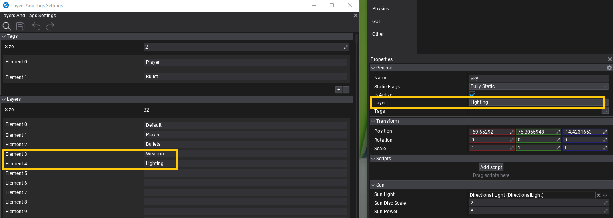
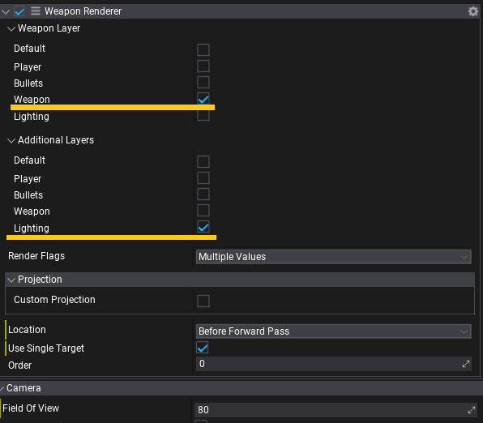

# HOWTO: Render FPS weapon

In this tutorial, you will learn how to create a custom PostFx script and use it to render player weapon in a first-person shooter game. It features:
* separate weapon rendering pass
* no clipping with world geometry
* customizable visuals for a weapon (eg. can disable SSAO/SSR)
* customizable render projection (weapon can be rendered with own FOV/Frustum)
* customizable lighting (eg. weapon can be affected only by sunlight).

### 1. Create script

Create a new script and add code that performs the effect rendering. Use **PostProcessEffect** class that inherits from Script and can be used as postfx on camera and view.

```cs
using FlaxEngine;

/// <summary>
/// PostFx script for custom player weapon rendering over world geometry. Attached to the player camera actor.
/// </summary>
public class WeaponRenderer : PostProcessEffect
{
    private Camera _camera;
    private SceneRenderTask _renderingTask;
    private GPUTexture _outputTexture;
    private GPUPipelineState _compositeOutputPipeline;

    /// <summary>
    /// Layer (or layers) that are used by weapon. Used to hide weapon from default scene rendering in the Game viewport.
    /// </summary>
    public LayersMask WeaponLayer = new LayersMask(0);

    /// <summary>
    /// Layer (or layers) that are used by additional objects used by weapon rendering (eg. lights, postfx volumes).
    /// </summary>
    public LayersMask AdditionalLayers = new LayersMask(0);

    /// <summary>
    /// Rendering features to use for weapon rendering (limited to main rendering - PostFx are configured in the main view drawing).
    /// </summary>
    public ViewFlags RenderFlags = ViewFlags.DirectionalLights |
                                   ViewFlags.SkyLights |
                                   ViewFlags.SpotLights |
                                   ViewFlags.PointLights |
                                   ViewFlags.SpecularLight |
                                   ViewFlags.Shadows |
                                   ViewFlags.ContactShadows |
                                   ViewFlags.Fog |
                                   ViewFlags.Reflections |
                                   ViewFlags.GI;

    /// <summary>
    /// If checked then weapon will be rendered with custom projection (customizable FOV and near/far planes).
    /// </summary>
    [EditorDisplay("Projection")]
    public bool CustomProjection = false;

    /// <summary>
    /// Custom Field Of View angle for the weapon rendering.
    /// </summary>
    [Range(30, 120), EditorDisplay("Projection"), VisibleIf(nameof(CustomProjection))]
    public float WeaponFov = 60.0f;

    /// <summary>
    /// Custom Near Plane distance for the weapon rendering.
    /// </summary>
    [Limit(0.0001f), EditorDisplay("Projection"), VisibleIf(nameof(CustomProjection))]
    public float WeaponNearPlane = 0.1f;

    /// <summary>
    /// Custom Far Plane distance for the weapon rendering.
    /// </summary>
    [Limit(10.0f), EditorDisplay("Projection"), VisibleIf(nameof(CustomProjection))]
    public float WeaponFarPlane = 10000.0f;

    public WeaponRenderer()
    {
        // Render weapons after scene is rendered but before any PostFx
        Location = PostProcessEffectLocation.AfterForwardPass;
        UseSingleTarget = true;
    }

    public override void OnEnable()
    {
        _camera = Actor.As<Camera>();
        if (_camera == null)
        {
            Debug.LogError("Attach WeaponRenderer to the player camera actor.", this);
            return;
        }

        // Disable weapons drawing in camera's view
        _camera.RenderLayersMask &= ~WeaponLayer;

        // Create new rendering task to draw
        _outputTexture = GPUDevice.Instance.CreateTexture("WeaponTexture");
        _renderingTask = new SceneRenderTask
        {
            IsCustomRendering = true, // Don't use automatic rendering but manually schedule rendering
            Output = _outputTexture,
        };
        _renderingTask.Buffers.LinkedCustomBuffers = MainRenderTask.Instance.Buffers;
        _renderingTask.Buffers.UseAlpha = true;

        // Create PSO that will draw weapon over the scene (rendered weapon is alpha-masked)
        var psoDesc = GPUPipelineState.Description.DefaultFullscreenTriangle;
        psoDesc.PS = GPUDevice.Instance.QuadShader.GetPS("PS_CopyLinear");
        psoDesc.BlendMode = BlendingMode.AlphaBlend;
        psoDesc.BlendMode.SrcBlend = BlendingMode.Blend.One;
        psoDesc.BlendMode.DestBlend = BlendingMode.Blend.InvSrcAlpha;
        psoDesc.BlendMode.BlendOp = BlendingMode.Operation.Add;
        psoDesc.BlendMode.SrcBlendAlpha = BlendingMode.Blend.One;
        psoDesc.BlendMode.DestBlendAlpha = BlendingMode.Blend.Zero;
        psoDesc.BlendMode.BlendOp = BlendingMode.Operation.Add;
        _compositeOutputPipeline = new GPUPipelineState();
        _compositeOutputPipeline.Init(ref psoDesc);
    }

    public override void OnDisable()
    {
        // Cleanup
        Destroy(ref _compositeOutputPipeline);
        Destroy(ref _outputTexture);
        Destroy(ref _renderingTask);
        _camera = null;
    }

    public override void Render(GPUContext context, ref RenderContext renderContext, GPUTexture input, GPUTexture output)
    {
        if (!_renderingTask)
            return;
        var camera = _camera ?? Actor.As<Camera>();
        if (!camera)
            return;
        Profiler.BeginEventGPU("Weapon");
        var width = input.Width;
        var height = input.Height;

        // Initialize weapon rendering
        var view = renderContext.View;
        view.Mode = ViewMode.NoPostFx; // Just render weapon with lighting, postfx are applied once for a whole game view
        view.RenderLayersMask = WeaponLayer | AdditionalLayers; // Render both weapon and lighting
        view.Flags = RenderFlags; // Select visual features to use during rendering
        if (CustomProjection)
        {
            // Customize projection matrix
            view.Near = WeaponNearPlane;
            view.Far = WeaponFarPlane;
            float aspect = (float)width / (float)height;
            float fov = WeaponFov * Mathf.DegreesToRadians;
            Matrix.PerspectiveFov(fov, aspect, view.Near, view.Far, out view.Projection);
            view.NonJitteredProjection = view.Projection;
            view.UpdateCachedData();
        }
        _renderingTask.View = view;

        // Setup rendering resolution
        if (!_outputTexture.IsAllocated)
        {
            var outputDesc = GPUTextureDescription.New2D(width, height, _renderingTask.Buffers.OutputFormat);
            _outputTexture.Init(ref outputDesc);
        }
        _renderingTask.Resize(width, height);

        // Reuse main game viewport GI/GlobalSDF/etc when rendering weapon
        _renderingTask.Buffers.LinkedCustomBuffers = renderContext.Buffers;

        // Render nested scene with weapon-only
        Renderer.Render(_renderingTask);

        // Composite weapon over the scene view
        context.ResetRenderTarget();
        context.SetViewport(width, height);
        context.SetRenderTarget(input.View());
        context.BindSR(0, _outputTexture.View());
        var pipeline = _compositeOutputPipeline;
        context.SetState(pipeline);
        context.DrawFullscreenTriangle();

        Profiler.EndEventGPU();
    }
}
```

### 2. Setup layers

Open [Layers and Tags settings](../../editor/game-settings/layers-and-tags-settings.md) and add separate layers for `Weapons` and `Lights`. Then set those layers to proper actors so the game *knows* which object is player's weapon, and which are lights on a scene.



### 3. Setup scene

Now, add created script to the Camera actor, link **WeaponLayer** property of the script to the layer with player weapon objects. Link **AdditionalLayers** property to global PostFx volume, Environment probes and Lights that should be used when rendering weapons.



You can also adjust rendering settings via **RenderFlags** property or override the projection matrix used for weapon rendering.

### 4. Test it out!

Finally start the game and see the result.


