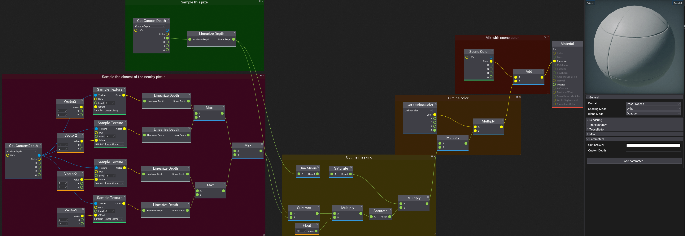
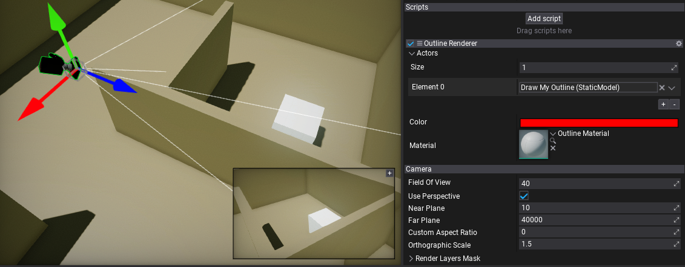
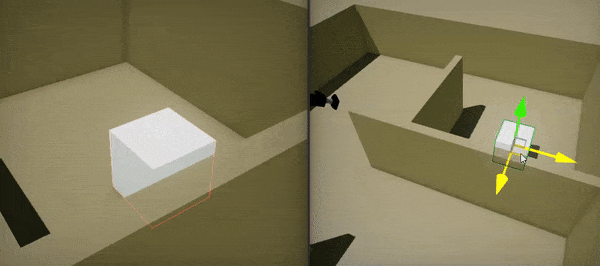

# HOWTO: Render object outline

In this tutorial you will learn how to create custom PostFx script and use it to render objects to a custom depth buffer for selection outline rendering.

### 1. Create PostFx material

Firstly, create post-process material that will use scene depth buffer and custom depth buffer to outline custom objects.

* Set the **Domain** to **Post Process**.
* Add new parameter **OutlineColor** of type **Color**
* Add new parameter **CustomDepth** of type **GPUTexture**
* Setup the graph as shown in a picture below (download image to zoom in)



### 2. Create script

Create a new script and add code that performs the effect rendering. Use **PostProcessEffect** class that inherits from Script and can be used as postfx on camera and view.

```cs
using System.Collections.Generic;
using FlaxEngine;

public class OutlineRenderer : PostProcessEffect
{
    private MaterialInstance _material;

    /// <summary>
    /// The list of actors to render.
    /// </summary>
    public List<Actor> Actors = new List<Actor>();

    /// <summary>
    /// The outline color.
    /// </summary>
    public Color Color = Color.Red;

    /// <summary>
    /// The outline postfx material.
    /// </summary>
    public MaterialBase Material;

    /// <inheritdoc/>
    public override void OnEnable()
    {
        _material = Material?.CreateVirtualInstance();
    }

    /// <inheritdoc/>
    public override void OnDisable()
    {
        Destroy(ref _material);
    }

    /// <inheritdoc />
    public override bool CanRender()
    {
        return base.CanRender() && _material && Actors?.Count != 0;
    }

    /// <inheritdoc/>
    public override void Render(GPUContext context, ref RenderContext renderContext, GPUTexture input, GPUTexture output)
    {
        Profiler.BeginEventGPU("Outline");

        // Pick a temporary depth buffer
        var desc = GPUTextureDescription.New2D(input.Width, input.Height, PixelFormat.D32_Float, GPUTextureFlags.DepthStencil | GPUTextureFlags.ShaderResource);
        var customDepth = RenderTargetPool.Get(ref desc);
        context.ClearDepth(customDepth.View());

        // Draw objects to depth buffer
        Renderer.DrawSceneDepth(context, renderContext.Task, customDepth, Actors);

        // Render outline
        _material.SetParameterValue("OutlineColor", Color);
        _material.SetParameterValue("CustomDepth", customDepth);
        Renderer.DrawPostFxMaterial(context, ref renderContext, _material, output, input.View());

        // Cleanup
        RenderTargetPool.Release(customDepth);

        Profiler.EndEventGPU();
    }
}

```

### 3. Setup scene

Now, add created script to the Camera actor, link **Material** property of the script to created outline postfx material and link the objects to draw their outline in **Actors** list. You can also adjust the color of the outline.



### 4. Test it out!

Finally start the game and see the result.


