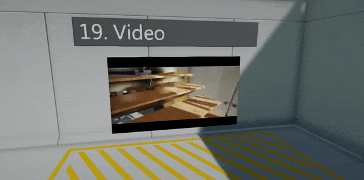
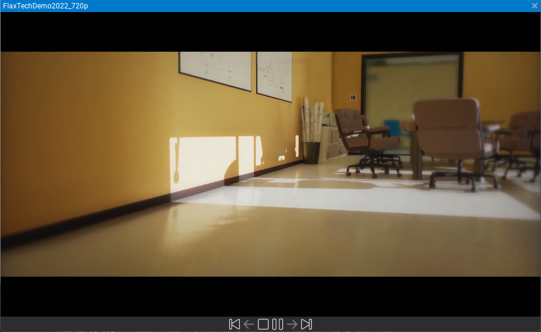
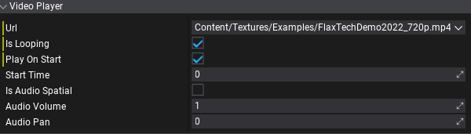
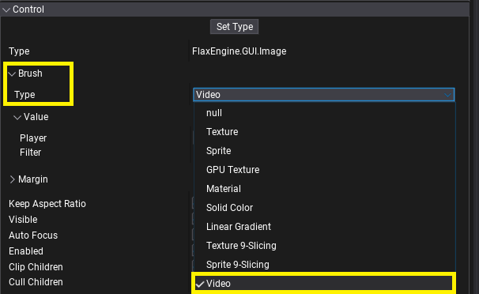
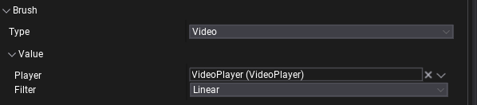

# Video



Video player allows to load `.mp4` files and play them with video and audio. This documentation describes how to import and use videos in your project.

## Importing video files

Use Content window import functionality or **drag&drop video files into the Content window** to copy source file into the project. Video files are identified by path in the project folder (relative to the root folder) and engine doesn't use any asset IDs nor meta files for them.



Then you can **double-click the asset item to open window** that can play video to preview it.

## Video Player



`VideoPlayer` is an actor used to play videos. It can be added on a scene, to prefab, attached to UI, or spawned dynamically from code. `Url` property defines the path of the video to play. It can be a local file, an absolute path, or HTTP URL. The editor offers a small dropdown button next to the URL text field, which shows the list of video files in the project to select from.

When cooking game video files (referenced by scenes/prefabs) are copied into the output `Content` directory (including sub-path preserving).

#### Properties

| Property | Description |
|--------|--------|
| **Url** | The video clip Url path used as a source of the media. Can be local file (absolute or relative path), or streamed resource (`http://`). |
| **Is Looping** | Determines whether the video clip should loop when it finishes playing. |
| **Play On Start** | Determines whether the video clip should autoplay on level start. |
| **Start Time** | Determines the time (in seconds) at which the video clip starts playing if *Play On Start* is enabled. |
| **Is Audio Spatial** | If checked, video player us using spatialization to play 3d audio, otherwise will always play as 2d sound. |
| **Audio Volume** | The volume of the audio played from this video, in `[0, 1]` range. |
| **Audio Pan** | The stereo pan of the played audio (`-1` is left speaker, `1` is right speaker, `0` is balanced). The default is 0. Used by non-spatial audio only. |
| **Audio Min Distance** | The minimum distance at which audio attenuation starts. When the listener is closer to the video player than this value, audio is heard at full volume. Once farther away the audio starts attenuating. Used by spatial audio only. |
| **Audio Attenuation** | The attenuation that controls how quickly does audio volume drop off as the listener moves further from the video player. At 0, no distance attenuation ever occurs. Used by spatial audio only. |

#### Scripting

| API | Description |
|--------|--------|
| **Play** | Starts playing the currently assigned video Url. |
| **Pause** | Pauses the video playback. |
| **Stop** | Stops video playback, rewinding it to the start. |
| **GetState** | Gets the current state of the video playback (playing/paused/stopped). |
| **GetTime** | Gets the current time of playback. The time is in seconds, in range `[0, Duration]`. |
| **SetTime** | Sets the current time of playback. The time is in seconds, in range `[0, Duration]`. |
| **GetDuration** | Gets the media duration of playback (in seconds). Valid only when media was loaded by the video backend. |
| **GetFrameRate** | Gets the media frame rate of playback (amount of frames to be played per second). Valid only when media was loaded by the video backend. |
| **GetSize** |  the video frame dimensions (in pixels). Valid only when media was loaded by the video backend. |
| **GetFrame** | Gets the video frame texture (GPU resource). Created on the playback start. Can be binded to materials and shaders to display the video image. |

## Video Brush



`VideoBrush` implements `IBrush` interface to display VideoPlayer's image inside UI. This can be used on `Image` control (or any other one using brushes) to display a video-based loading screen, game studio intro, pre-rendered cutscenes, or endgame subtitles. Video Brush needs a reference to the Video Player to access GPU Texture - assign it via `Player` property.



## Materials

To display a video frame on a mesh in the world add `GPUTexture` parameter to the material and set it to the `VideoPlayer.Frame` from the script. See below for the example script:

```cs
using System;
using System.Collections.Generic;
using FlaxEngine;

public class MyVideoMesh : Script
{
    public VideoPlayer Player;
    public StaticModel Model;
    public string VideoFrameParamName = "VideoFrame";

    private List<MaterialInstance> _materials = new List<MaterialInstance>();

    public override void OnEnable()
    {
        // Play video
        // Note: Player.Frame might be missing if video has not started playback yet
        Player.Play();

        // Create dynamic materials for the meshes that use material with a param
        var slots = Model.MaterialSlots;
        for (int i = 0; i < slots.Length; i++)
        {
            var material = Model.GetMaterial(i);
            if (material.GetParameter(VideoFrameParamName) != null)
            {
                // Create virtual material with custom parameter value
                material = material.CreateVirtualInstance();
                material.SetParameterValue(VideoFrameParamName, Player.Frame);
                slots[i].Material = material;
                _materials.Add(material);
            }
        }
    }

    public override void OnDisable()
    {
        // Remove dynamic materials
        var slots = Model.MaterialSlots;
        foreach (var slot in slots)
        {
            if (_materials.Contains(slot.Material as MaterialInstance))
            {
                // Unlink virtual material (mesh will use default one)
                slot.Material = null;
            }
        }
        _materials.Clear();
    }
}
```

## Naming

* `H.264` or `AVC` - common video format
* `H.265` or `HEVC` - advanced video format
* `HLC` - HTTP Live Streaming

## Supported formats

Flax supports decoding and playing `.mp4` videos in format `H.264` across all platforms. Some platforms have additional restrictions (eg. max frame rate or max resolution), while others support more formats. Use the following table to learn about platforms support (approximation, follow platform docs to learn more):

| Platform | Backend | H.264 | H.265 | HLS | Max Resolution
|--------|--------|--------|--------|--------|--------|
| **Windows** | [Media Fundation](https://learn.microsoft.com/en-us/windows/win32/medfound/microsoft-media-foundation-sdk) | X | X | X | 4K |
| **Xbox** | [Media Fundation](https://learn.microsoft.com/en-us/windows/win32/medfound/microsoft-media-foundation-sdk) | X |  |  | FullHD |
| **Android** | [Android NDK Media](https://developer.android.com/ndk/reference/group/media) | X |  | X | FullHD |
| **Linux** | *not implemented* |  |  |  |  |
| **macOS** | [AVFoundation](https://developer.apple.com/av-foundation/) | X | X | X | 4K |
| **iOS** | [AVFoundation](https://developer.apple.com/av-foundation/) | X | X | X | 4K |
| **PS4** | *AvPlayer* | X |  |  | FullHD |
| **PS5** | *AvPlayer* | X |  |  | FullHD |
| **Switch** | *movie* | X |  |  | FullHD |
