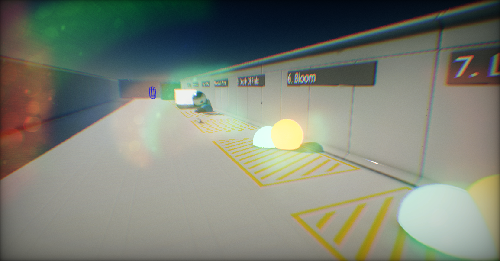
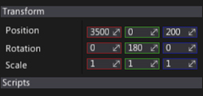
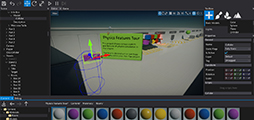
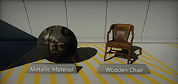
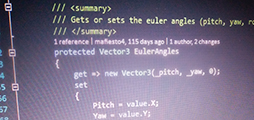

# Flax Engine Manual

These pages contain information about how to use Flax Engine. This manual helps you learn how to use the Flax Editor and its associated tools. You can read it from start to finish, or use it as a reference.

## Sections

<h3><a href="get-started/index.md">Get started</a></h3>

Introduction for developers starting out creating games with Flax Engine.

<h3><a href="editor/index.md">Editor manual</a></h3>

Guide to using and configuring the Flax Editor.

<h3><a href="samples-tutorials/index.md">Tutorials</a></h3>

Collection of sample projects and tutorials.

<h3><a href="graphics/index.md">Graphics</a></h3>

Flax rendering features documentation.

<h3><a href="scripting/index.md">Scripting</a></h3>

C# scripting manual with tutorials and examples.

<h3><a href="physics/index.md">Physics</a></h3>

Flax physics engine simulation manual.

## Help us creating documentation

The Flax documentation is open-source, which means anyone can edit it. If you find a mistake, you can correct it or comment on GitHub. [Here](https://github.com/FlaxEngine/FlaxDocs) is an official repository.

