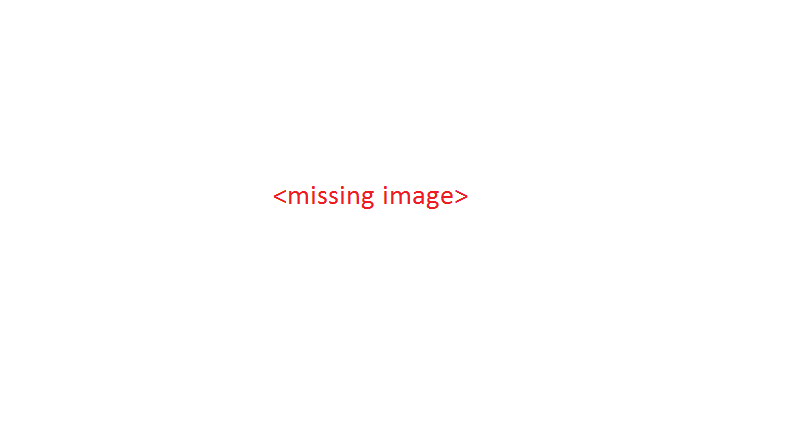

# Flax Engine Manual

These pages contain information about how to use Flax Engine. This manual helps you learn how to use the Flax Editor and its associated tools. You can read it from start to finish, or use it as a reference.

>[!Note]
>Flax Engine manual is under construction and updated regularly with new content.

## Latest documentation

// TODO: keep updates channel live

## Help us creating documentation

The Flax documentation is open-source, whichmeans anyone can edit it. If you find a mistake, you can correct it or comment in GitHub. [Here](https://github.com/FlaxEngine/FlaxDocs) is official repository.

