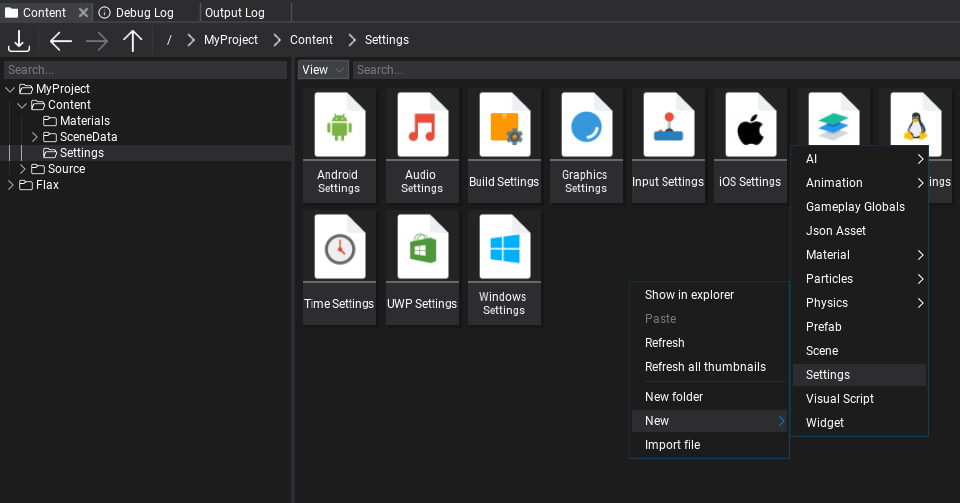
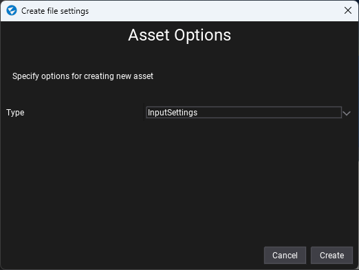
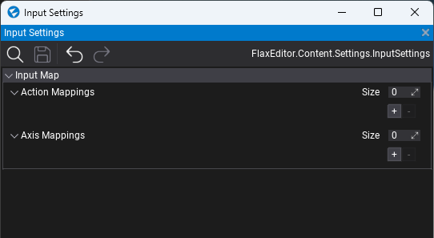
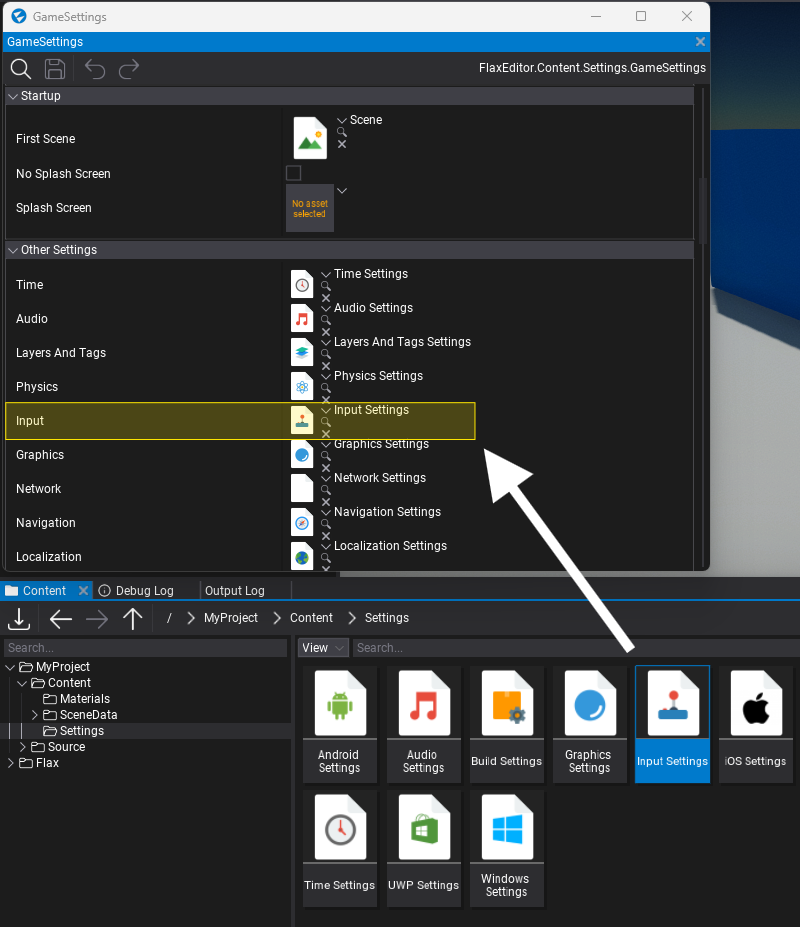
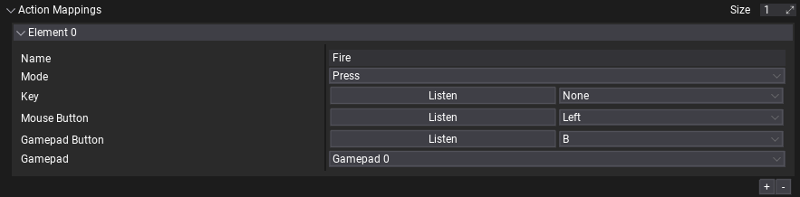
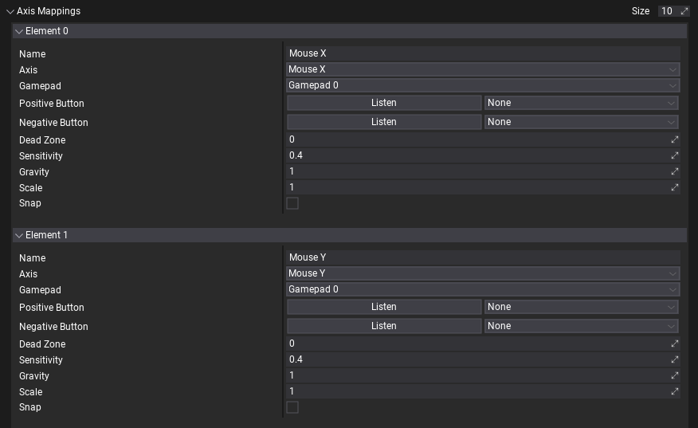
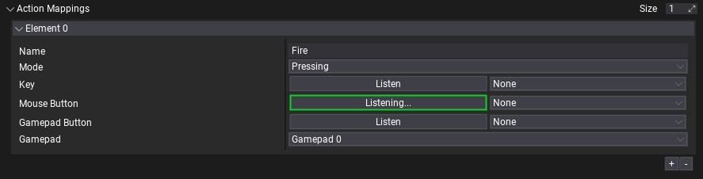
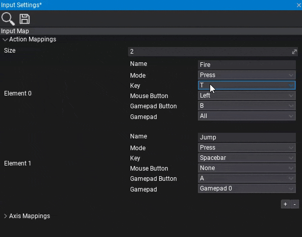

# Input Settings

The **Input Settings asset** is used to set the default input configuration for your game. This asset contains a description of the Action Mappings and Axis Mappings that are used to map physical inputs into a more unified configuration. See the [Virtual Input](virtual-input.md) page to learn more.

## Create input settings

1. Navigate to the Content directory in the *Content* window

2. Right-click and select option **New -> Settings**, specify the asset name (eg. *Input Settings*) and hit *Enter*
    

3. Choose option **Input Settings** and press the **Create** button
    

4. Double-click on an asset to open and edit it.
    

## Use input settings

You can create as many input settings assets as you want, (even special versions per platform) but only one can be used when building your game. Use the **Game Settings** asset (always located in `Content/GameSettings.json`) to specify which input settings asset you would like to use. If your game is using a more advanced configuration, you can edit the game settings from code in your build script (use [GameSettings.Load](https://docs.flaxengine.com/api/FlaxEditor.Content.Settings.GameSettings.html#FlaxEditor_Content_Settings_GameSettings_Load) and [GameSettings.Save](https://docs.flaxengine.com/api/FlaxEditor.Content.Settings.GameSettings.html#FlaxEditor_Content_Settings_GameSettings_Save__1___0_) from the C# API).

## Action Mappings

**Action Mappings** are used to configure virtual actions. It's useful to bind physical mouse or gamepad buttons to specific actions identified by the name. Later the game may track those input events using the action names.

Useful C# API: [InputEvent](https://docs.flaxengine.com/api/FlaxEngine.InputEvent.html), [Input.ActionConfig](https://docs.flaxengine.com/api/FlaxEngine.ActionConfig.html) and [Input.ActionMappings](https://docs.flaxengine.com/api/FlaxEngine.Input.html#FlaxEngine_Input_ActionMappings).

| Property | Desciption |
|--------|--------|
| **Name** | The action *"friendly name"* used to access it from code. |
| **Mode** | The trigger mode. Allows the user to specify when input events should be fired. See [InputActionMode](https://docs.flaxengine.com/api/FlaxEngine.InputActionMode.html). |
| **Key** | The [keyboard key](https://docs.flaxengine.com/api/FlaxEngine.KeyboardKeys.html) to map for this action. Use *None* to ignore it. |
| **Mouse Button** | The [mouse button](https://docs.flaxengine.com/api/FlaxEngine.MouseButton.html) to map for this action. Use *None* to ignore it. |
| **Gamepad Button** | The [gamepad button](https://docs.flaxengine.com/api/FlaxEngine.GamepadButton.html) to map for this action. Use *None* to ignore it. |
| **Gamepad** | Which gamepad should be used. |

## Axis Mappings

**Axis Mappings** are used to configure virtual axes. It's useful to bind a physical gamepad trigger or a mouse movement into a normalized and unified input source. Later the game may access those input axes values using a virtual input interface.

Useful C# API: [InputAxis](https://docs.flaxengine.com/api/FlaxEngine.InputAxis.html), [Input.AxisConfig](https://docs.flaxengine.com/api/FlaxEngine.AxisConfig.html) and [Input.AxisMappings](https://docs.flaxengine.com/api/FlaxEngine.Input.html#FlaxEngine_Input_AxisMappings).

| Property | Desciption |
|--------|--------|
| **Name** | The axis *"friendly name"* used to access it from code. |
| **Axis** | The axis type (mouse, gamepad, etc.). See [InputAxisType](https://docs.flaxengine.com/api/FlaxEngine.InputAxisType.html). |
| **Gamepad** | Which gamepad should be used. |
| **Positive Button** | The button to be pressed for movement in positive direction. Use *None* to ignore it. |
| **Negative Button** | The button to be pressed for movement in negative direction. Use *None* to ignore it. |
| **Dead Zone** | Any positive or negative values that are less than this number will register as zero. Useful for gamepads to specify the deadzone. |
| **Sensitivity** | For keyboard input, a larger value will result in faster response time (in units/s). A lower value will be more smooth. For Mouse delta the value will scale the actual mouse delta. |
| **Gravity** | For keyboard input, this describes how fast the input recenters. Speed (in units/s) at which the output value resets to the neutral value when the device is at rest. |
| **Scale** | Additional scale parameter applied to the axis value. Allows to invert it or modify the range. |
| **Snap** | If checked, the axis value will be immediately reset to zero after it receives opposite inputs. Used for keyboard input only. |

## Keyboard Keys selection

Sometimes picking the right input for your action/axis mapping can be problematic because there are so many options to scroll through. To make this easier, you can press the 'Listen' button, and then press whatever input you want mapped onto this action. This makes it easier to setup your input settings for any input device.

Another way you can set the input is to **use your keyboard to search** for the item in the dropdown menu. By pressing a letter key multiple times, it will take you through each key starting with that letter. You can also **navigate with arrow keys** through the list and **confirm the choice with Enter**. This feature works with all long context menu lists across the Editor.

