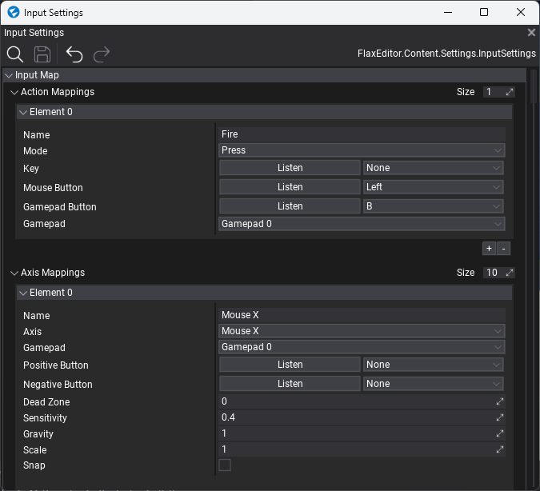
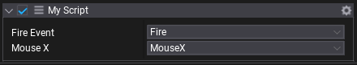

# Virtual Input

**Virtual input** is a Flax feature used to unify the input data across different input devices and runtime platforms. It helps with cross-platform development and adds a convenient abstraction layer between raw input devices and the game scripts. It's highly configurable and can be used in all games made with Flax.

This documentation covers the most important parts of the virtual input interface and helps with the usage.

## Settings and usage

The first step to use the virtual input is preparng a proper configuration. This is done via **Input Settings** asset. You can learn more about creating and using those settings on [Input Settings](input-settings.md) page. If you're using one of the *Flax Templates* it should already contain a proper configuration file in `Content/Settings/Input Settings.json`. Open this asset in the Editor.



As you can see on the above image there are several configurations in that file. For instance, `Left Mouse Button` and `Gamepad button A` are configured to trigger the input action named `Fire` (even triggered on `Press`).

Then in your C# script you can handle this action:

```cs
public void Update()
{
	if (Input.GetAction("Fire"))
	{
		ShootBall();
	}
}
```

Also you can use [InputEvent](https://docs.flaxengine.com/api/FlaxEngine.InputEvent.html) and [InputAxis](https://docs.flaxengine.com/api/FlaxEngine.InputEvent.html) classes to configure it even better:

```cs
public InputEvent FireEvent = new InputEvent("Fire");
public InputAxis MouseX = new InputAxis("MouseX");

public MyScript()
{
	FireEvent.Triggered += ShootBall;
}

public void Update()
{
	var mouseX = MouseX.Value;
	...
}
```

Then if you select the object with this script in Editor you can modify the `FireEvent` and `MouseX` mappings names so it can be modified without editing the code.



