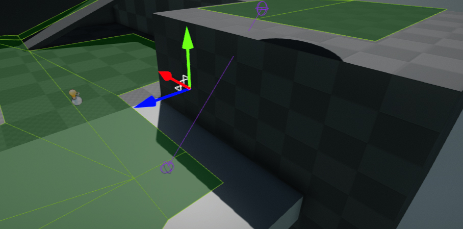

# Nav Link

**Nav Link** is an actor type used to define a custom point-to-point edge within the navigation graph. An off-mesh connection is a user defined traversable connection made up to two vertices, at least one of which resides within a navigation mesh polygon allowing movement outside the navigation mesh.
