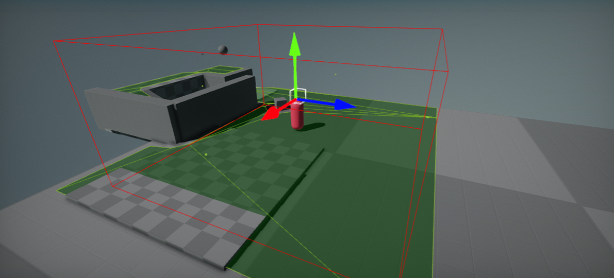

# Nav Mesh Bounds Volume

**Nav Mesh Bounds Volume** is an actor type that is a special type of volume which defines the areas of the scene in which navigation meshes are generated. Place those volumes in your scene to define the areas where you AI can move around.
