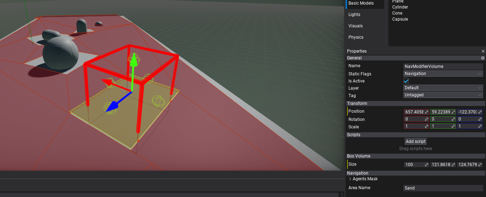
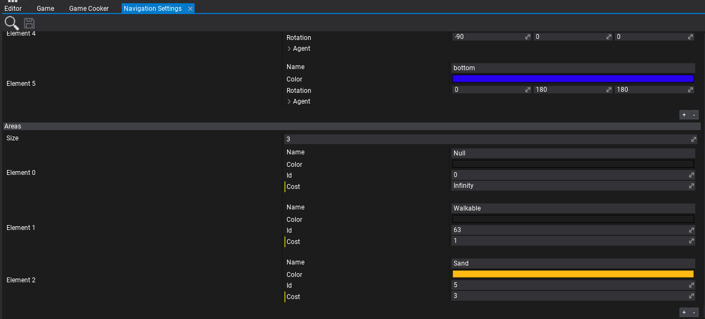

# Nav Modifier Volume

**Nav Modifier Volume** is an actor type used to modify the navmesh area. For instance, it can used to restrict navigation in a certain area, implement dynamic obstacle or to change area traversal cost. Use it on dynamic obstacles that can block navigation paths for AI or to adjust the movement cost for AI over a certain area (eg. sand).

## Nav Areas

Navigation Modifier Volume contains `Area Name` property which defines the name of the area it applies. The areas properties are define in [Navigation Settings](navigation-settings.md) asset per-project.

In the following example, there are 3 area types: *Null*, *Walkable* and *Sand*. The first is special with `Id=0` for areas withotu navigation mesh. The second on marks the default areas that can be traversed. The last one *Sand* was added with `Cost=3` so nav modifiers using it can increase the cost of moving over the navmesh area (in this example moving over the sand is slower so AI will pick paths that try to avoid it to reach target quicker).

