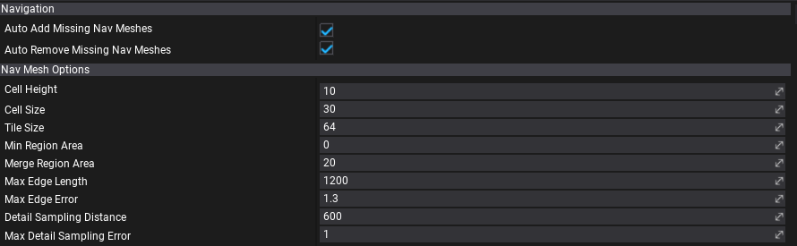
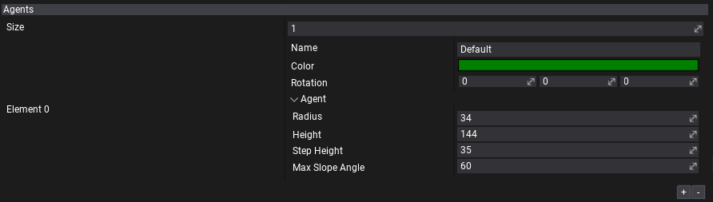
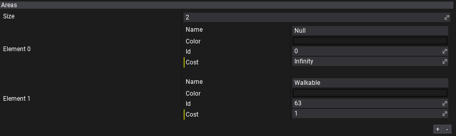

# Navigation Settings

Navigation settings asset specifies the navmesh building options and other settings used by the navigation system.

## Properties

| Property | Description |
|--------|--------|
| **Auto Add Missing Nav Meshes** | If checked, enables automatic navmesh actors spawning on a scenes that are using it during navigation building. |
| **Auto Remove Missing Nav Meshes** | If checked, enables automatic navmesh actors removing from a scenes that are not using it during navigation building. |
|||
| **Cell Height** | The height of a grid cell in the navigation mesh building steps using heightfields. A lower number means higher precision on the vertical axis but longer build times. |
| **Cell Size** | The width/height of a grid cell in the navigation mesh building steps using heightfields. A lower number means higher precision on the horizontal axes but longer build times. |
| **Tile Size** | Tile size used for Navigation mesh tiles, the final size of a tile is CellSize*TileSize. |
| **Min Region Area** | The minimum number of cells allowed to form isolated island areas. |
| **Merge Region Area** | Any regions with a span count smaller than this value will, if possible, be merged with larger regions. |
| **Max Edge Len** | The maximum allowed length for contour edges along the border of the mesh. |
| **Max Edge Error** | The maximum distance a simplfied contour's border edges should deviate from the original raw contour. |
| **Detail Sampling Distance** | Defines the sampling distance to use when generating the detail mesh. |
| **MaxDetail Sampling Error** | The maximum distance the detail mesh surface should deviate from heightfield data. For height detail only. |

## Agents

The configuration for navmeshes. Each navmesh can use different agent properties (eg. one navmesh for small AI bot, another for big boss enemy). You can also adjust navmeshes colors or even generate them on walls by using Rotation property.

| Property | Description |
|--------|--------|
| **Name** | The navmesh type name. Identifies different types of the navmeshes, used to sync navmesh properties with settings asset. |
| **Color** | The navmesh type color (for debugging). |
| **Rotation** | The navmesh rotation applied to navigation surface. Used during building to the rotate scene geometry and to revert back result during path finding queries. Can be used to generate navmesh on walls. |
| *Agent* | The properties of the agent used to generate walkable navigation surface. |
| **Radius** | The radius of the agent used for navigation. Agents can't pass through gaps of less than twice the radius. |
| **Height** | The height of the agent used for navigation. Agents can't enter areas with ceilings lower than this value. |
| **Step Height** | The step height used for navigation. Defines the maximum ledge height that is considered to still be traversable by the agent. |
| **Max Slope Angle** | The maximum slope (in degrees) that is considered walkable for navigation. Agents can't go up or down slopes higher than this value. |

## Areas

The configuration for navigation areas. Can be used to apply them with [Nav Modifier Volume](nav-modifier-volume.md) to adjust the navigation cost on the area of the level.

| Property | Description |
|--------|--------|
| **Name** | The area type name. Identifies different types of the areas. |
| **Color** | The area type color (for debugging). Alpha channel is used to blend with navmesh color (alpha 0 to use navmesh color only). |
| **Id** | The area id. It must be unique for the project. Valid range 0-63. Value 0 is reserved for Null areas (empty, non-navigable areas). |
| **Cost** | The cost scale for the area traversal for agents. The higher the cost, the less likely agent wil choose the path that goes over it. For instance, areas that are harder to move like sand should have higher cost for proper path finding. |
