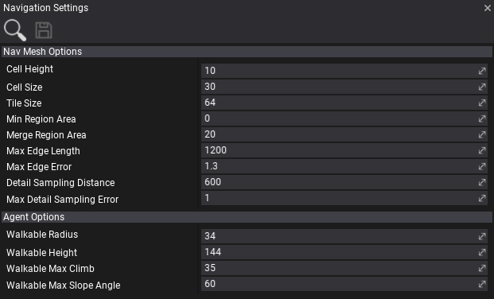

# Navigation Settings

Navigation settings asset specifies the navmesh building options and other settings used by the navigation system.

## Properties

| Property | Description |
|--------|--------|
| **Cell Height** | The height of a grid cell in the navigation mesh building steps using heightfields. A lower number means higher precision on the vertical axis but longer build times. |
| **Cell Size** | The width/height of a grid cell in the navigation mesh building steps using heightfields. A lower number means higher precision on the horizontal axes but longer build times. |
| **Tile Size** | Tile size used for Navigation mesh tiles, the final size of a tile is CellSize*TileSize. |
| **Min Region Area** | The minimum number of cells allowed to form isolated island areas. |
| **Merge Region Area** | Any regions with a span count smaller than this value will, if possible, be merged with larger regions. |
| **Max Edge Len** | The maximum allowed length for contour edges along the border of the mesh. |
| **Max Edge Error** | The maximum distance a simplfied contour's border edges should deviate from the original raw contour. |
| **Detail Sampling Distance** | Defines the sampling distance to use when generating the detail mesh. |
| **MaxDetail Sampling Error** | The maximum distance the detail mesh surface should deviate from heightfield data. For height detail only. |
|||
| **Walkable Radius** | The radius of the smallest objects to traverse this nav mesh. Objects can't pass through gaps of less than twice the radius. |
| **Walkable Height** | The height of the smallest objects to traverse this nav mesh. Objects can't enter areas with ceilings lower than this value. |
| **Walkable Max Climb** | The maximum ledge height that is considered to still be traversable. |
| **Walkable Max Slope Angle** | The maximum slope that is considered walkable (in degrees). Objects can't go up or down slopes higher than this value. |
