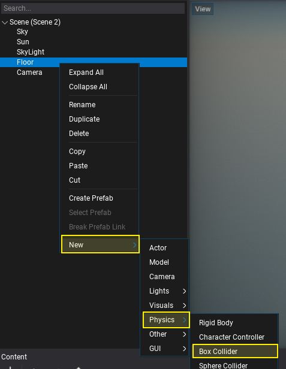
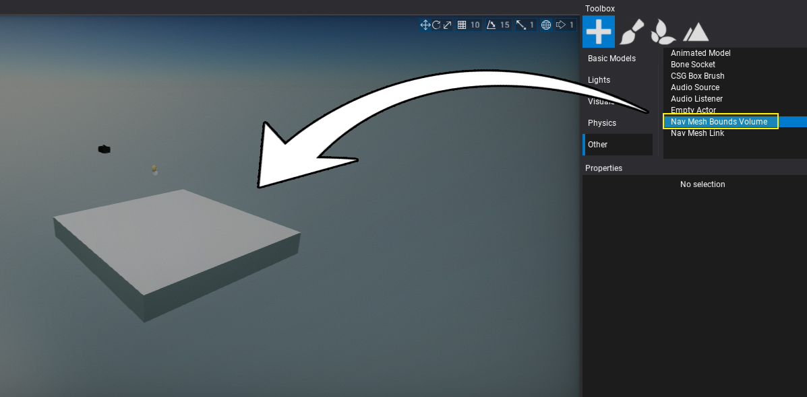
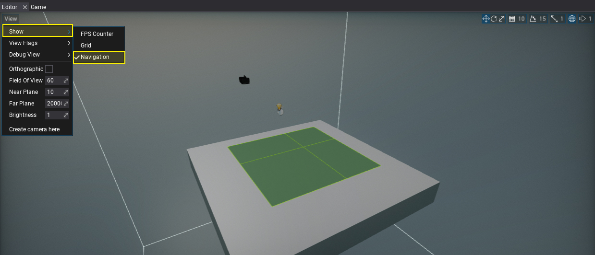

# HOWTO: Create navmesh

In this tutorial, you will learn how to create navmesh for you scene.

## 1. Open a new scene

Firstly you will need to open scene. If you don't have any just use a Content Window context menu to create one.

## 2. Add collider

Use *Toolbox Window* or context menu in the *Scene Tree Window* to add collider to the floor model as showin below.

The navigation mesh generator uses physics collisions to define the environment of the level rather than meshes.

## 2. Add Nav Mesh Bounds Volume

Use *Toolbox Window* or context menu in the *Scene Tree Window* to add navigation mesh bounds actor. It is used to define the area of the level where navmesh should be generated.

## 3. See results

By default navmesh is auto-generated by Editor so now you can see it by enabling widget option **View -> Show -> Navigation** to preview the navmesh. To rebuild navmesh for the loaded scenes you can use option from main menu, which is **Tools -> Build Nav Mesh**.

