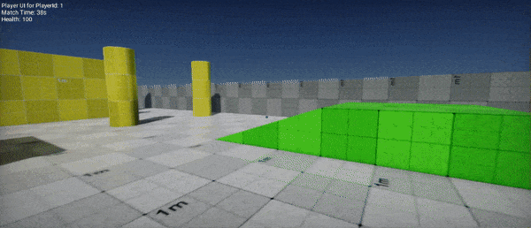

# Networking

Flax supports networking that can be used across various types of games. You can use it to create multiplayer games or to extend the gameplay by using an Internet connection.

To integrate your game into various online platforms such as Steam, Xbox Live or PlayStation Network use [Online](online/index.md) system which provides the access to player user profile, friends list, achievements, online presence, cloud saves and more.

## Low-Level and High-Level

Flax contains three layers of networking:
* [Sockets](network-api.md) with raw Berkeley sockets (cross-platform) for UDP/TCP connections.
* [Low-level](low-level.md) with `NetworkPeer`, `INetworkDriver` and `NetworkMessage` API which supports low-level networking packets via messages networking.
* [High-level](high-level.md) with `NetworkManager`, `NetworkClient` and `NetworkStream` API which suppors high-level objects replications, spawning, RPCs invoking, object authority and object ownership.

The high-level wraps over low-level and provides more features for multiplayer games which is favored in most cases. Follow documentation to learn more.

## In this section

* [Network API](network-api.md)
* [Network Sample](network-sample.md)
* [Low-Level Networking](low-level.md)
* [High-Level Networking](high-level.md)
* [Online](online/index.md)

## Tutorials

* [How to create TCP client-server](tutorials/create-tcp-client-server.md)
* [How to create networking server and client](tutorials/network-client-server.md)

## Sample projects

* [Arizona Framework Sample](../samples-tutorials/samples/arizona.md)
* [Network Sample](network-sample.md)
