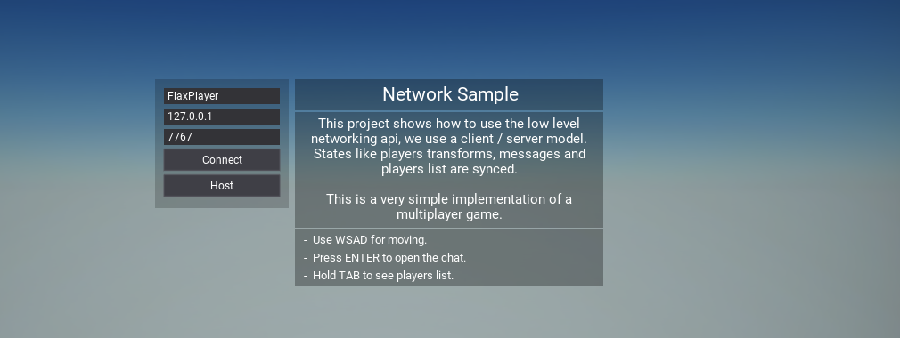
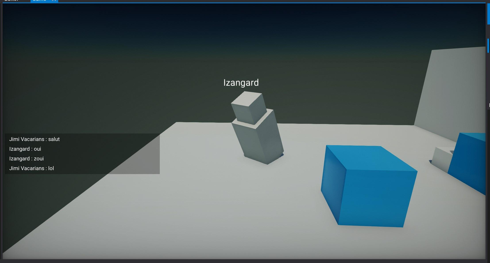
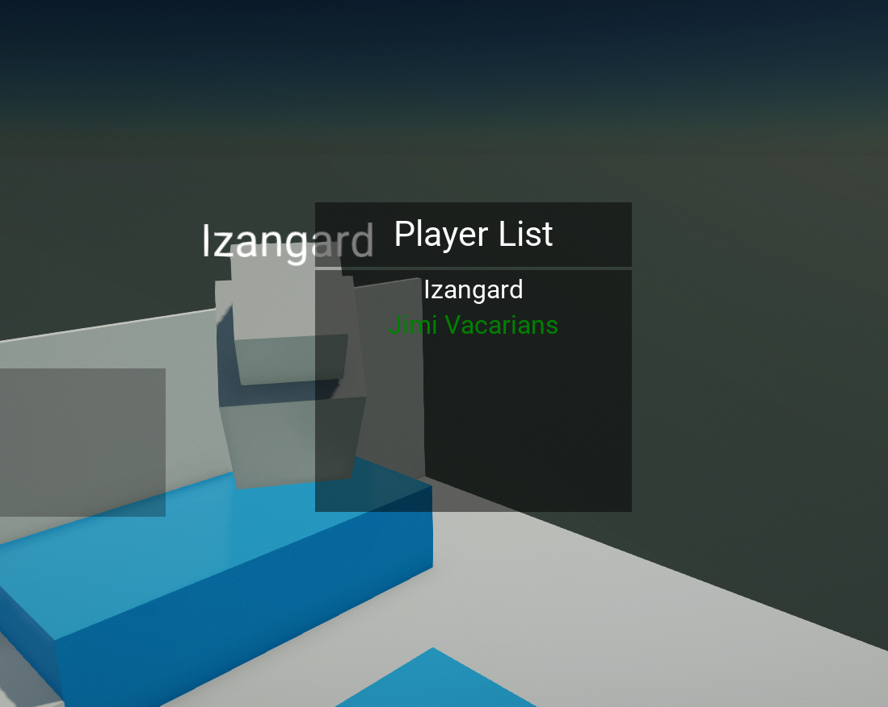

# Network Sample

[Network Sample](https://github.com/FlaxEngine/NetworkSample) is an open-source sample project that contains multiplayer game lobby implementation with player synchronization and chat. It can be used as a foundation for multiplayer projects using Flax low-level networking transportation layer.

## Guide

1. Download project from [Github](https://github.com/FlaxEngine/NetworkSample) (as Zip or clone with Git)
2. Open project
3. Open `Menu` scene and Play!
4. In the main menu, you can specify the player nickname, server IP, and port
5. Start a server with Host button or use Connect button to connect running server

You can also use Game Cooker to build game into a standalone application to run multiple instances of clients and a server.

## Screenshots

## Overview

Main types overview:
* **Player** - player information container (Name, ID, Actor, etc.)
* **GameSession** - game service with players list including local player
* **NetworkSession** - game service with packets and network connections handling
* **Game/Network/Packets...** - various types of network packets used by the sample (implementations of `NetworkPacket`)

## License

Project is released under **MIT License**.
