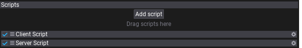
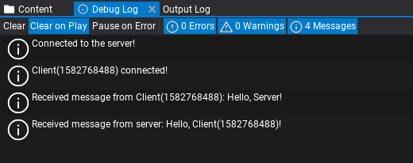

# HOWTO: Create networking server and client

In the following tutorial you will learn how to create a simple server and client scripts using networking system in Flax. This sample uses C# but the API is also available for C++ and Visual Scripting.

## 1. Create scripts

The first step is to create empty scripts for both server and client. Those can be named `ServerScript` and `ClientScript`.

## 2. Initialize server

A server is a network peer that listens for incoming connection requests but also sends and receives messages.

The server script below creates a new `NetworkPeer` when scripts get enabled with a specified configuration for the network transportation layer. After creation, the server peer starts to listen for the incoming connections (`Listen` method). The peer object is later disposed in `OnDisable`.

```cs
public class ServerScript : Script
{
    private NetworkPeer _server;

    /// <inheritdoc />
    public override void OnEnable()
    {
        _server = NetworkPeer.CreatePeer(new NetworkConfig
        {
            NetworkDriverType = NetworkDriverType.ENet,
            ConnectionsLimit = 8,
            MessagePoolSize = 1024,
            MessageSize = 1400,
            Address = "any",
            Port = 7777
        });
        _server.Listen();
    }

    /// <inheritdoc />
    public override void OnDisable()
    {
        NetworkPeer.ShutdownPeer(_server);
        _server = null;
    }
}
```

Peer configuration properties:
* `NetworkDriverType` - network driver for the peer (must be the same for all the peers).
* `ConnectionsLimit` - the maximum amount of active connections with this peer.
* `MessagePoolSize` - the amount of pooled messages that can be used at once (receiving and sending). Adjusted per-game for best net performance.
* `MessageSize` - the size of a message buffer in bytes. Should be lower than the MTU (maximal transmission unit) - typically around 1500 bytes.
* `Address` - address used to connect to or listen at. Set it to "any" when you want to listen at all available addresses.
* `Port` - port to connect to or listen at.

## 3. Initialize client

A client is also a network peer and works similar to the server example.

In this sample client peer gets initialized with own network settings and explicitly specified localhost adress (`127.0.0.1` constant) that is the IP of the server (assumes the server runs on the same machine). Then it connects to the server peer (`Connect` method). The peer object is later disposed in `OnDisable`.

In real-life game projects the target IP to connect to would be a game-server static IP address constant or domain name.

```cs
public class ClientScript : Script
{
    private NetworkPeer _client;

    /// <inheritdoc />
    public override void OnEnable()
    {
        _client = NetworkPeer.CreatePeer(new NetworkConfig
        {
            NetworkDriverType = NetworkDriverType.ENet,
            ConnectionsLimit = 32,
            MessagePoolSize = 256,
            MessageSize = 1400,
            Address = "127.0.0.1",
            Port = 7777
        });
        _client.Connect();
    }

    /// <inheritdoc />
    public override void OnDisable()
    {
        NetworkPeer.ShutdownPeer(_client);
        _client = null;
    }
}
```

## 4. Server logic

Now, we can set up actual network messages handling to the server. To do so simply override `OnUpdate` method in the `ServerScript` and add the code as shown below.

During every game tick the server script pops the accumulated events from the network peer queue. Then each event type is handled separately: new connections, disconnections, timeouts, and messages. Every event has its `Sender` field to identify the network peer that sent this event.

In this example server prints when new peer connects or disconnects and handles messages. When the server receives the message prints it and sends a simple *hello world* text as well. `SendHelloWorld` function sends a sample text message using `Reliable` (message will be always delivered).

```cs
/// <inheritdoc />
public override void OnUpdate()
{
    if (_server == null) return;
    while (_server.PopEvent(out var eventData))
    {
        switch (eventData.EventType)
        {
        case NetworkEventType.Connected:
        {
            Debug.Log($"Client({eventData.Sender.ConnectionId}) connected!");
            break;
        }
        case NetworkEventType.Disconnected:
        case NetworkEventType.Timeout:
        {
            Debug.Log($"Client({eventData.Sender.ConnectionId}) disconnected!");
            break;
        }
        case NetworkEventType.Message:
        {
            // Read the message contents
            var message = eventData.Message;
            var messageData = message.ReadString();

            Debug.Log($"Received message from Client({eventData.Sender.ConnectionId}): {messageData}");

            // Send hello message to the client back
            SendHelloWorld(eventData.Sender);

            break;
        }
        default:
            throw new ArgumentOutOfRangeException();
        }
    }
}

private void SendHelloWorld(NetworkConnection connection)
{
    var message = _server.BeginSendMessage();
    message.WriteString($"Hello, Client({connection.ConnectionId})!");
    _server.EndSendMessage(NetworkChannelType.Reliable, message, connection);
}
```

## 5. Client logic

Client update loop uses a similar concept (code below). It also pops the new incoming events. When a client gets connected to the server it prints the log and sends a simple *hello world* text message (see `SendHelloWorld` method). When a client gets disconnected or timeout prints it to the log. On a new incoming message, it gets read from the stream and print into the Debug output.

```cs
/// <inheritdoc />
public override void OnUpdate()
{
    if (_client == null) return;
    while (_client.PopEvent(out var eventData))
    {
        switch (eventData.EventType)
        {
        case NetworkEventType.Connected:
        {
            Debug.Log("Connected to the server!");

            // Send hello message to the server
            SendHelloWorld();

            break;
        }
        case NetworkEventType.Disconnected:
        case NetworkEventType.Timeout:
        {
            Debug.Log("Disconnected from the server!");
            break;
        }
        case NetworkEventType.Message:
        {
            // Read the message contents
            var message = eventData.Message;
            var messageData = message.ReadString();

            Debug.Log($"Received message from server: {messageData}");

            break;
        }
        default:
            throw new ArgumentOutOfRangeException();
        }
    }
}

private void SendHelloWorld()
{
    var message = _client.BeginSendMessage();
    message.WriteString("Hello, Server!");
    _client.EndSendMessage(NetworkChannelType.Reliable, message);
}
```

## 6. Testing



Finally, the scripts can be tested. You can add them to an actor on a scene to quickly preview it in Editor in action. Later you can implement a custom logic that would run Server or Client depending on some configuration or game build.

The logic flow:
* Both server and client start
* Client connects to the server
* Server gets `Connected` event and prints info
* Client gets `Connected` event and sends *Hello World* message to the server
* Server receives *Hello World* message, prints it and responds with a similar message
* Client receives *Hello World* message and prints it too



As you can see it's a very basic example of how to implement server and client peers using the networking layer in Flax. To see a more advanced example of networking for a game see [Network Sample](../network-sample.md) project that features players synchronization and game lobby with chat. It uses player listin

