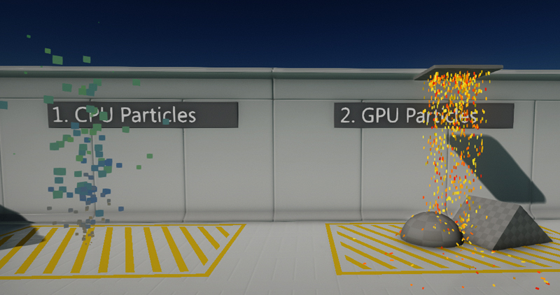
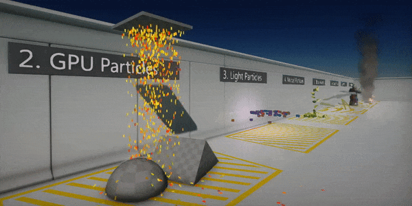

# Particles

Flax supports large-scale particles simulation and performant rendering of sprite, mesh and ribbon particles. Advanced toolset in Editor helps to create complex visual effects. Particle system allows to easily extend it and produce desired particle effects. Use this documentation section to learn how to create your particles effects to create a great visual experience.

## Basics

**Particles** are objects that, used in large numbers, create visual effects. You can use particles to create effects such as fire, explosion, liquid, smoke, lightning, magic effects, heat distortion, etc.

Particle system is designed to enable developers to create visual effects quickly and with the ability to scale the content. Adding particles to the game requires creating [Particle Emitter](particle-emitter.md) asset, setting up [Particle System](particle-system.md) asset, and particles playback via [Particle Effect](particle-effect.md) actor that is placed on a scene to simulate the visual effect. This content-oriented pipeline allows to easily create and reuse different types of emitters to make various types of effects. Also, particle emitter is defined via visual graph to improve the creation process for the artists.

## Technical details

Flax supports both **CPU and GPU particles simulation**. Particle Emitter Graph can be executed directly on the CPU to simulate particles or used to generate compute shader source for the large-scale GPU particles simulation.

For better understanding please read the following comparison:

| CPU Simulation | GPU Simulation |
|--------|--------|
| Low-latency | High-throughput |
| Up to 200k particles | Up to 5,000k particles |
| Optimized for small systems | Optimized for huge simulations |
| Requries sending draw data to GPU every frame | All simulation data stored on GPU |
| Cannot sample scene textures | Can sample scene textures |
| No requirements | Compute Shaders and Draw Indirect requried |

In addition, GPU particles are not supported if emitter uses ribbons or lights. However, GPU particles can sample textures efficiently and perform depth-buffer collisions for a large number of particles.

>[!Note]
>Always try to assign the particle emitter capacity to the actual required value to improve simulation performance and reduce memory usage.

## In this section

* [Particle Emitter](particle-emitter.md)
* [Particle System](particle-system.md)
* [Particle Effect](particle-effect.md)
* [Particle Parameters](particle-parameters.md)
* [Particle Materials](particle-materials.md)
* [Particle Functions](particle-functions.md)
* [Particle Optimization](particle-optimization.md)

## Tutorials

* [How to fade particles near camera](tutorials/fade-near-camera.md)
* [How to make soft particles](tutorials/soft-particles.md)
* [How to rotate particle position shape](tutorials/rotate-particles.md)
