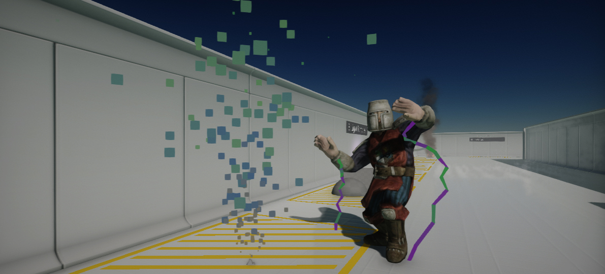
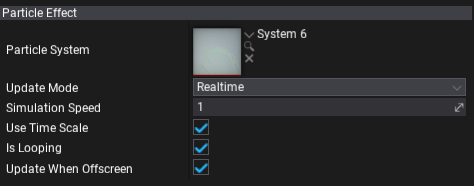

# Particle Effect

**Particle Effect** is an actor type that can playback the particles simulation in the scene. Use to add particles to your game.

## Simulation modes

The particles simulation supports 2 different update modes:
* **Realtime** - updates particles during every game logic update.
* **Fixed Timestep** - uses fixed timestep delta time to update particles simulation with a custom frequency.

In most cases, using realtime updates is the most common option but if your particles simulation simulations physics collisions you may need more stable updates running at the fixed timestamps.

## Properties

| Property | Description |
|--------|--------|
| **Particle System** | The particle system to play. |
| **Update Mode** | The particles simulation update mode. Defines how to update particles emitter. |
| **Fixed Timestep** | The fixed timestep for simulation updates. Used only if `UpdateMode` is set to `FixedTimestep`. |
| **Simulation Speed** | The particles simulation speed factor. Scales the particle system update delta time. Can be used to speed up or slow down the particles. |
| **Use Time Scale** | Determines whether the particle effect should take into account the global game time scale for simulation updates. |
| **Is Looping** | Determines whether the particle effect should loop when it finishes playing. |
| **Update When Offscreen** | If checked, the particle simulation will be updated even when an actor cannot be seen by any camera. Otherwise, the simulation will stop running when the actor is off-screen. |
