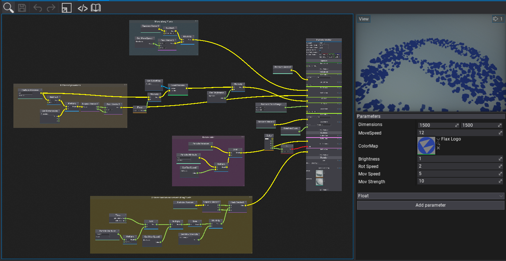
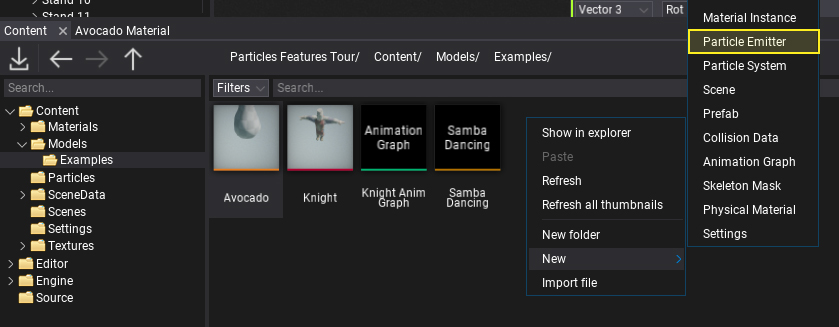
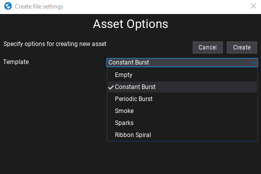
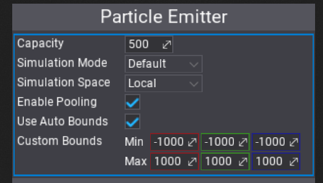
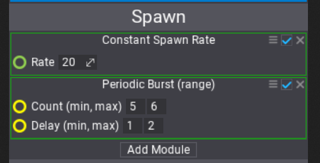
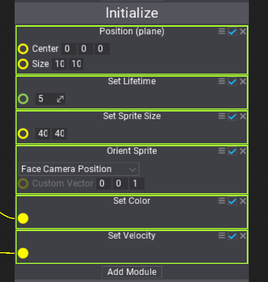
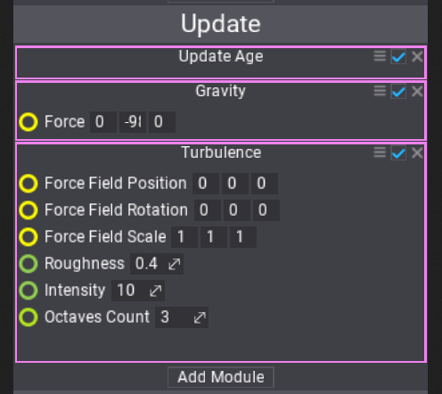
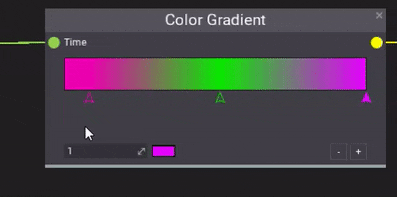
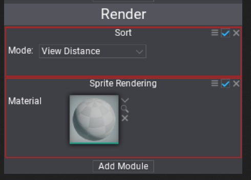
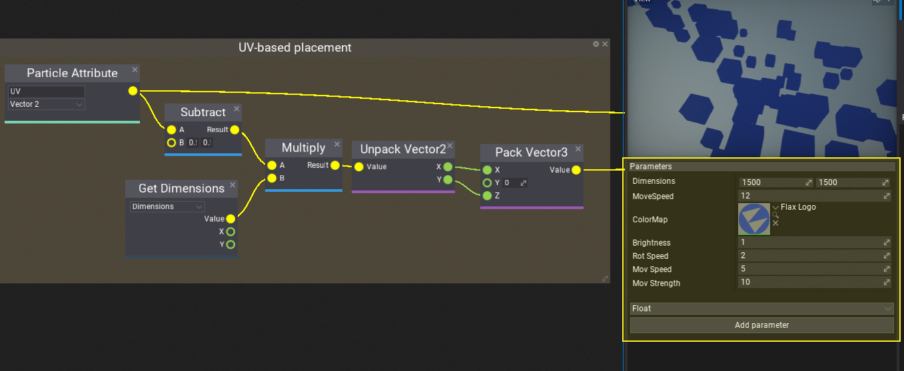

# Particle Emitter



**Particle Emitter** asset is used to define the particles simulation. Allows to specify the spawn rules, simulation logic and describe how to render particles. Emitter is based on the visual graph to define the logic and create content. This make it easier to build complex system but also to understand how the simulation works visually.

## Create Emitter



The first step is to create a new asset. It's a binary file and contains the nodes graph data as well as a set of graph parameters description. Use the `Content` window to create a new asset. Right-click and select option **New -> Particle Emitter**. Specify its name and hit Enter to confirm. Then you can select the template for the emitter to create. Select the one for you needs to start working on content faster. You can also choose the blank emitter to start up from scratch.



## Edit Emitter

Particle Emitter graph always contains the main node that defines the basic properties of the simulation and contains a linear list of particle modules that implement actual logic. All of it can be highly extended and customized via using graph nodes such as *Gradient*, *Curve* and so on.

## Particle Emitter context



The top of the main node defines the basic options of the particles emitter.

| Property | Description |
|--------|--------|
| **Capacity** | The maximum amount of particles to simulate. |
| **Simulation Mode** | Specifies the particles simulation execution context. Use it to explicitly run a simulation on CPU or GPU. The default mode picks the best matching environment based on the emitter capacity and runtime platform. |
| **Simulation Space** | Defines how to perform particles calculations. **Local** space of the particle effect actor or in **World** space. |
| **Enable Pooling** | If checked, enables the particles buffers memory pooling to improve performance for particles effects spawned multiple times (eg. explosions, gun fire). |
| **Use Auto Bounds** | If checked, particle emitter bounds will be computed based on the position of the particles (not supported for GPU particles). |

### Spawn context



Before any particles simulation can take place, particles have to be spawned. **Spawn context** contains a list of modules that can spawn particles based on custom rules.

### Initialize context



All modules from the **Initialize context** are executed for all particles before adding them to the simulation. This initialization happens for spawned particles and can be used to setup the properties, initialize particle lifetime, and place the particles.

### Update context



**Update context** defines the actual particles simulation logic. Modules are executed one after another and perform the simulation logic such as aging particles, applying gravity and simulating collisions.

Update context can be used to animate anything in particles. Here is sth example of particle color animation using the **Color Gradient** node used to sample the gradient over the particle normalized age.



### Render context



The last is **Render context** that defines how to render the particles. Can be used to set up the particles sorting and billboard sprites rendering or even render lights at particles locations. Remember to use materials with *Particle* domain to draw particles shapes.

## Parameters



Every particle emitter can contain a list of parameters. By using them you can easily configure the simulation or make it dependant of the gameplay logic. For instance, particles color can be assigned from the script and used to color the particles of the flare smoke to mark the player team color.

```cs
var effect = Actor.As<ParticleEffect>();
effect.SetParameterValue("Emitter 0", "FlareColor", Color.Red);
```


