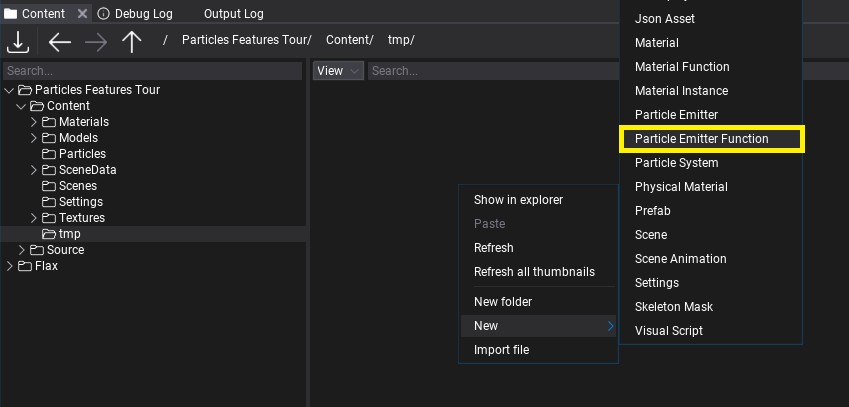
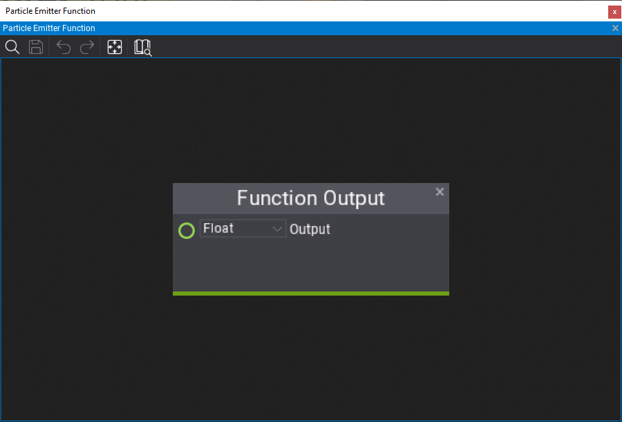
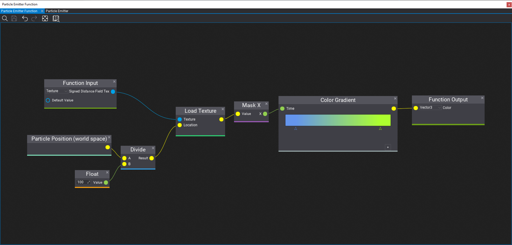
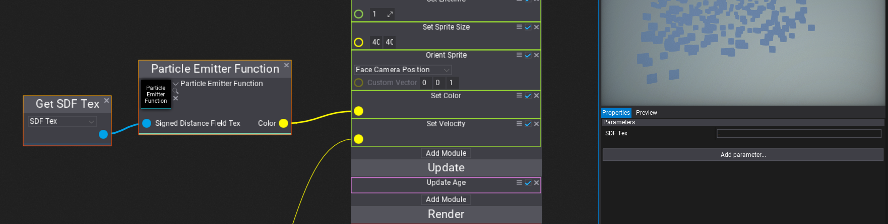

# Particle Functions

**Particle Emitter Function** is an asset that contains a reusable particle graph with a set of customizable inputs and outputs. Particle functions can be used in particle emitters and other particle functions to implement custom logic that can be reused multiple times. For instance, you can create a custom noise generator and reuse it in different assets. Particles functions are a great way of improving content creation and technical art.

## How to create a Particle Function

The first step is to *right-click* in *Content* window and choose option **New -> Particle Emitter Function**. Then specify its name and confirm with *Enter*. Open the asset editor by double-clicking on it.

Now, you can let out your creativity and implement literally anything here. Particle Function is a graph of normal particle nodes but it contains custom **Function Output** and **Function Input** nodes on the graph that represent the function arguments and returned values. Particle function can use textures and perform complex calculations enclosed in a reusable graph.

By default, a new function will contain single *Float* output. You can edit the returned value type using the combobox and rename the output variable by double-clicking on the name label (*Output* by default).

Below is an example of the function that gets the *Texture* input and samples it at the particle location (simple SDF texture sampling). Particle functions can have multiple inputs and outputs that accept basic types and texture references too. Input nodes contain **Default Value** box that is optional and can be used to assign the default value of the input if caller doesn't specify it.

## How to use Particle Function

Particle function can be used in any other particle function (excluding cyclic references) or particle emitter asset. To use it you can simply drag and drop the asset item into the target graph or use *right-click* and pick **Particle Function** node, then pick the asset you've created. The node will populate the input and output boxes according to the function signature.

Finally, Flax will automatically update all particle emitters using the particle function if you modify it so you can freely work on the art content easily.

