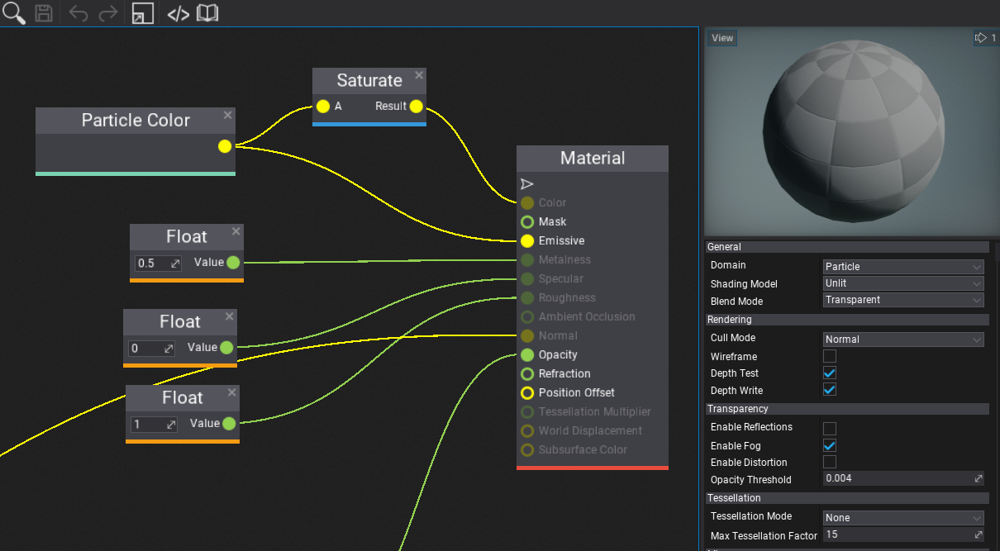
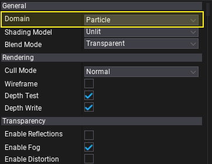
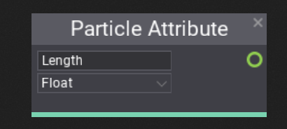
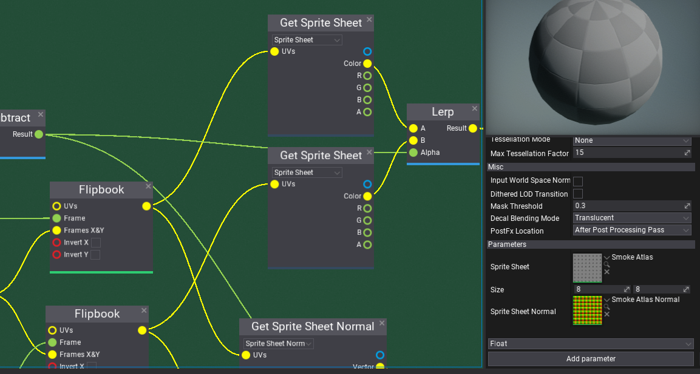

# Particle Materials

Particles rendering uses a dedicated shader domain that supports sprite, model and ribbon particles. To use custom material for your particles ensure to select **Domain** to **Particle** in *Material Window*.

## Particle Attributes

Particle materials can easily access any attribute of the rendered particle. You can use predefined nodes such as **Particle Color**, **Particle Normalized Age**, or **Particle Mass**. If your particle system uses any custom attributes shader can read them via **Particle Attribute** node. Simply specify the attribute name and type and the data will be available to read.

## Sprite sheet animation

Many particle systems such as smoke, fire, and explosions use sprite sheet to animate the particle texture over time. To do so simply use **Flipbook** node that implements sampling the sprite sheet.

