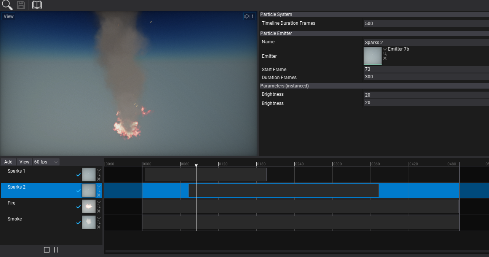
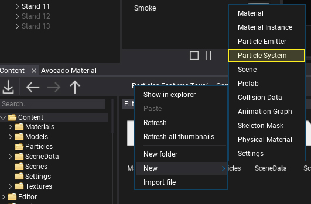
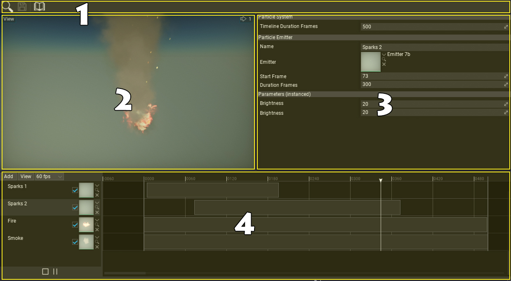

# Particle System

**Particle System** asset uses a timeline with particle emitter tracks to define the visual effect playback. It can contain a single particle emitter to simulate or an advanced combination of effects to create stunning visuals. Tracks can be divided into folders to organize the hierarchy and help with content production.

## Create System

The first step is to create a new asset. It's a binary file and contains the timeline data. Use the `Content` window to create a new asset. Right-click and select option **New -> Particles -> Particle System**. Specify its name and hit Enter to confirm. 
Double-click the created asset to modify it.

## Editor Window

Particle System editor window contains:
1. Toolbar
2. Preview viewport
3. Properties editor
4. Timeline editor

To add new track use **Add** button and select **Emitter**. Then you can assign the particle emitter asset to play. Select created track label area to edit its properties in the editor and tweak parameters in live preview.

Each particle emitter track contains a single media event that represents the emitter update time. You can move it and adjust its duration via mouse and dragging event edges. Each track can be muted via a dedicated checkbox. To rename or delete tracks right-click on its label.
