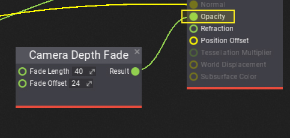

# HOWTO: Fade particles near camera

In this tutorial, you will learn how to fade particles that are near camera to prevent the flickering/popping effect and make it look smoother.

## 1. Create particle material

Firstly you will need to create or reuse your particle material. You can follow [those instructions](../../graphics/materials/basics/index.md) to learn how to do it. Remember to set **Domain** to **Particle**.

## 2. Add Camera Depth Fade

Now, add new **Camera Depth Fade** node to the surface and connect its output with particle opacity input. Then you can adjust the fade distance and offset to match the desire transition.

