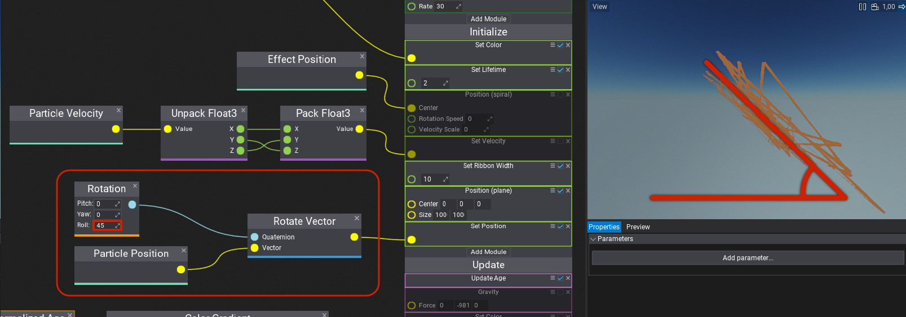

# HOWTO: Rotate particle position shape

In this tutorial, you will learn how to rotate the particle position shape.

Add the following nodes found in the image. Change the `Rotation` node's values to rotate the shape in the desired direction.

