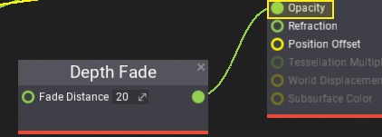
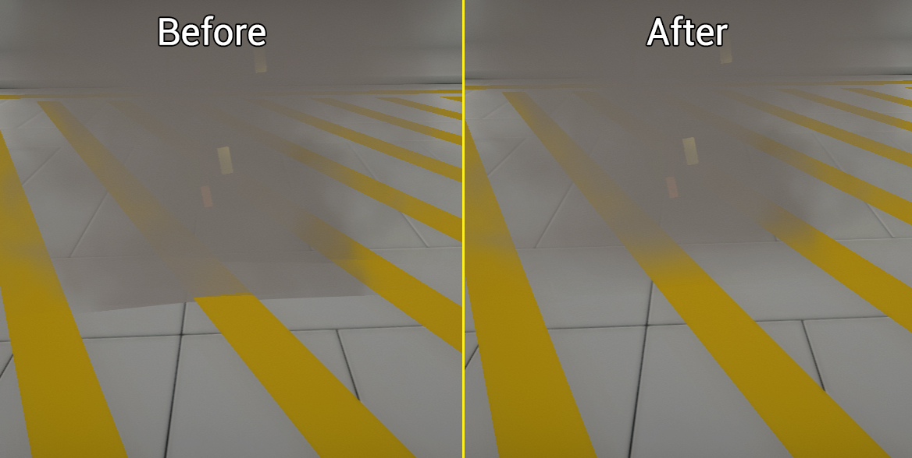

# HOWTO: Make soft particles

In this tutorial, you will learn how to fade particles that are near scene geometry to make them look smoother. The presented technique uses the scene depth buffer to blend off particle pixels that are near scene geometry.

## 1. Create particle material

Firstly you will need to create or reuse your particle material. You can follow [those instructions](../../graphics/materials/basics/index.md) to learn how to do it. Remember to set **Domain** to **Particle**.

## 2. Add Depth Fade

Now, add new **Depth Fade** node to the surface and connect its output with particle opacity input. Then you can adjust the fade distance to match the desire transition.

## 3. See results

Using soft particles helps with hiding the transition between particle and scene geometry which makes look them better. The only drawback is the performance cost of sampling depth buffer and performing the blend operation.

