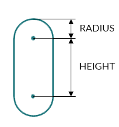
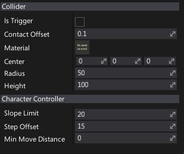

# Character Controller

The **character controller** is an actor type used for the player objects to provide collision-based physics but also to allow for more customizations dedicated to game characters (player or NPCs). It's a common choice for first-person and third-person games.

## Character volume

The character uses a **capsule**, defined by a center position, a vertical height and a radius. The height is the distance between the two sphere centers at the end of the capsule. For example, the capsule has better behavior when climbing stairs.

To implement character crouching or dynamic size changing, use `Resize(float height, float radius)`. It updates the character height and center position to ensure its feet position stays the same. It maintains the same actor position to stay in the middle of capsule by adjusting center of collider accordingly to height difference.

## Auto stepping

Without auto-stepping it is easy for a character to get stuck against slight elevation changes in a ground mesh. It feels unnatural because in the real world a person would just cross over these small obstacles.

You can adjust auto-stepping behaviour by using [CharacterController.SlopeLimit](https://docs.flaxengine.com/api/FlaxEngine.CharacterController.html#FlaxEngine_CharacterController_SlopeLimit) and [CharacterController.StepOffset](https://docs.flaxengine.com/api/FlaxEngine.CharacterController.html#FlaxEngine_CharacterController_StepOffset) properties.

## Properties

| Property | Description |
|--------|--------|
| **Is Trigger** | *Not used. Derived from the Collider base class.* |
| **Contact Offset** | Colliders whose distance is less than the sum of their ContactOffset values will generate contacts. The contact offset must be positive. Contact offset allows the collision detection system to predictively enforce the contact constraint even when the objects are slightly separated. |
| **Material** | The physical material used to define the collider physical properties. |
| **Center** | The center of the collider, measured in the object's local space. |
| **Radius** | The radius of the sphere, measured in the object's local space. It will be scaled by the actor's world scale. |
| **Height** | The height of the capsule, measured in the object's local space. It will be scaled by the actor's world scale. |
| **Slope Limit** | Limits the collider to only climb slopes that are less steep (in degrees) than the indicated value. |
| **Non Walkable Mode** | Specifies the non-walkable mode for the character controller. Possible options:  <table><tbody><tr><th>Option</th><th>Description</th></tr><tr><td>**Prevent Climbing**</td><td>Stops character from climbing up non-walkable slopes, but doesn't move it otherwise.</td></tr><tr><td>**Prevent Climbing and Force Sliding**</td><td>Stops character from climbing up non-walkable slopes, and forces it to slide down those slopes.</td></tr></tbody></table> |
| **Origin Mode** | Specifies how a character controller capsule placement. Possible options:  <table><tbody><tr><th>Option</th><th>Description</th></tr><tr><td>**Capsule Center**</td><td>Character origin starts at capsule center (including Center offset properly).</td></tr><tr><td>**Base**</td><td>Character origin starts at capsule base position aka character feet placement.</td></tr></tbody></table> |
| **Step Offset** | The character will step up a stair only if it is closer to the ground than the indicated value. This should not be greater than the Character Controller’s height or it will generate an error. |
| **Up Direction** | Character up vector. |
| **Min Move Distance** | The minimum travelled distance to consider. If travelled distance is smaller, the character doesn't move. This is used to stop the recursive motion algorithm when remaining distance to travel is small. |
| **Auto Gravity** | Automatic gravity force applying mode. Can be toggled off if gameplay controls character movement velocity including gravity, or toggled on if gravity should be applied together with root motion from animation movement. |
