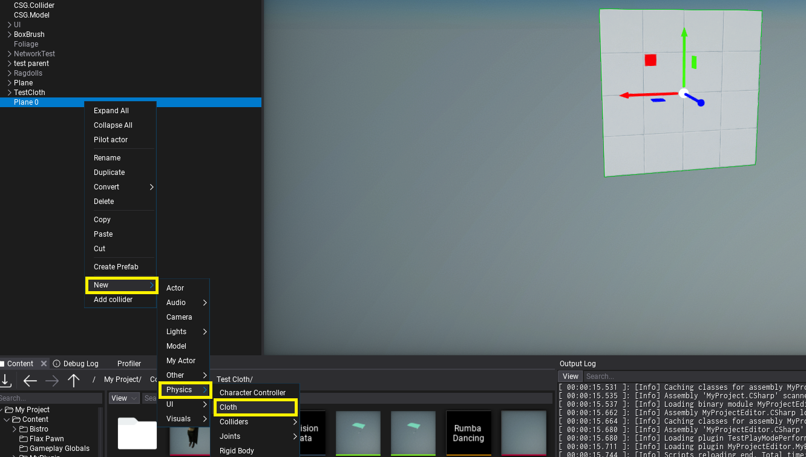
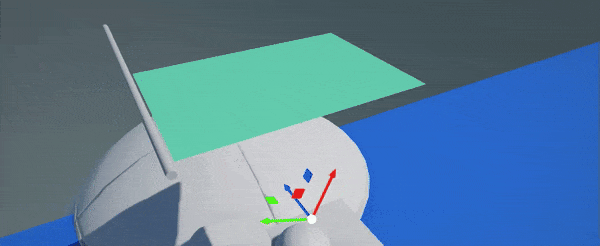
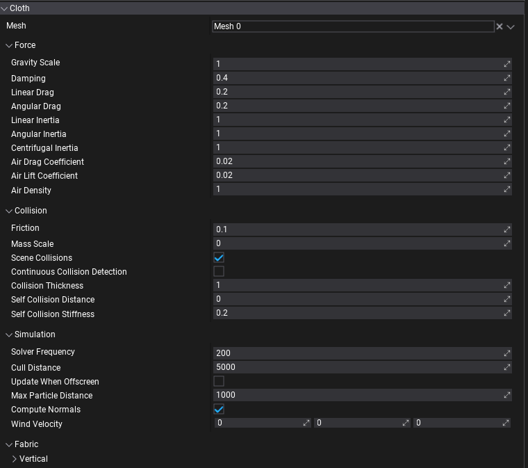

# Cloth

**Cloth** actor uses vertices of the mesh as cloth particles and simulates them with physical properties, forces, constraints, and collisions. By adding it to the Static Model or Animated Model actor (as a child) you can select sub-mesh to turn into cloth.

### Setup

1. Add cloth actor

Use **New -> Physics -> Cloth** on a model or drag Cloth from [Toolbox](../editor/windows/toolbox.md). This will add cloth under a model actor (Static Model or Animated Model). Each model actor can have multipel cloths - eg. one for each model's mesh or LOD. Also, Cloth can be used in Prefab Window for reusability (eg. on game character clothing parts).

Use *Mesh* property to select the parent's model mesh (from specific LOD) to override with cloth simulation. Mesh reference picker will show all meshes in the model.

2. Paint cloth

Now you can use left-mouse-button to paint over the cloth vertices and mark immovable vertices (marked with red color). Properites panel will display cloth settings and brush settings (eg. brush radius or paint value). Click to paint over vertices, click while holding `Ctrl` to inverse paint (eg. to paint movable vertices). You can adjust brush proeprties to use more precise painting or to tweak paint value for semi-movable vertices.

Cloth paint value is between `0-1` range (inclusive), where `0` means no movement (locked), `1` means movement up to *Max Particle Distance* distance from the original cloth location.

3. Try it out!

Run game in Editor to see the simulation result. If you move cloth's parent model it will appear as realistic fabric. You can control wind forces applied on cloth.

### Collisions

When *Scene Collisions* option is enabled cloth system will gather colliders nearby the cloth actor (matching Cloth's [physics layer mask](physics-settings.md), updated every few frames in async). Then cloth simulation will support runtime collisions against the environment (both static and dynamic).

If cloth intersects too much with the world-geometry use *Collision Thickness* property to increase the margin between cloth particles and colliders. Also, self-collisions settings can come handy when creating thicker fabrics (eg. carpet or drapes).

The limit for colliders is 32 spheres and 32 planes total per cloth - collides with convex needs to use less than 32 planes set as a limit in order to properly behave. Each capsule collider uses 2 spheres from that limit. Triangle mesh and heightfield (terrain) collisions are not supported due to expensive computations and large data.

### Characters

Cloth can be used on [skinned models](../animation/skinned-model/index.md) (even simutesly with *blend shapes*). You can use cloth on a skinned model submesh (eg. character hair, clothing parts like straps) or a whole mesh (like shown on a gif above). In both cases, be sure to precisely paint immovable particles that should still receive animation. You can use *Fill* button to assign a certain paint value to all particles and then manually mark movable ones.

Use [debug views](../graphics/debugging-tools/debug-view.md) (eg. *Physics Colliders*) to analyze cloth surface and its collisions with character/environment. Cloth can use custom physical layers mask to define with which objects it should collider (eg. to exclude collisions with Character Controller body but only with manually specified model bone colliders - like shown on a gif above).

### Technical details

Cloth uses [NvCloth](https://github.com/NVIDIAGameWorks/NvCloth) library to run simulation (on CPU only). It's supported on all platforms and **Flax runs the simulation in async** via [Job System](../scripting/advanced/multithreading.md) after Fixed Update when physics world was updated (can be at different rate than game is being renderer). Due to the fact that cloth simulation performs operations on mesh data (which can be large) it's extensively using job system and efficent data management to handle large amount of cloths simulated in game at once. Additionaly, you can tweak *Cull Distance* and disable *Update When Offscreen* options to control impact on the performance. If your game uses custom-shading or cloth is unlit mesh then you can uncheck *Compute Normals* option to get more performance.

### Properties

| Property | Description |
|--------|--------|
| **Mesh** | The mesh to use for the cloth simulation (single mesh from specific LOD). |
| Force | |
| **Gravity Scale** | Scale multiplier applied to the gravity of cloth particles (scales the global gravity force). |
| **Damping** | Damping of cloth particle velocity. 0: velocity is unaffected. 1: velocity is zeroed. |
| **Linear Drag** | Portion of velocity applied to cloth particles. 0: cloth particles are unaffected. 1: damped global cloth particle velocity. |
| **Angular Drag** | Portion of angular velocity applied to turning cloth particles. 0: cloth particles are unaffected. 1: damped global cloth particle angular velocity. |
| **Linear Inertia** | Portion of linear acceleration applied to cloth particles. 0: cloth particles are unaffected. 1: physically correct linear acceleration. |
| **Angular Inertia** | Portion of angular acceleration applied to turning cloth particles. 0: cloth particles are unaffected. 1: physically correct angular acceleration. |
| **Centrifugal Inertia** | Portion of angular velocity applied to turning cloth particles. 0: cloth particles are unaffected. 1: physically correct angular velocity. |
| **Air Drag Coefficient** | Defines how much drag air applies to the cloth particles. Set to 0 to disable wind. |
| **Air Lift Coefficient** | Defines how much lift air applies to the cloth particles. Set to 0 to disable wind. |
| **Air Density** | Defines fluid density of air used for drag and lift calculations. |
| Collision | |
| **Friction** | Controls the amount of friction between cloth particles and colliders. 0: friction disabled. |
| **Mass Scale** | Controls how quickly cloth particle mass is increased during collisions. 0: mass scale disabled. |
| **Scene Collisions** | Enables collisions with scene geometry (both dynamic and static). Disable this to improve performance of cloth that doesn't need to collide. |
| **Continuous Collision Detection** | Enables Continuous Collision Detection (CCD) that improves collision by computing the time of impact between cloth particles and colliders. The increase in quality can impact performance. |
| **Collision Thickness** | Additional thickness of the simulated cloth to prevent intersections with nearby colliders. |
| **Self Collision Distance** | The minimum distance that the colliding cloth particles must maintain from each other in meters. 0: self collision disabled. |
| **Self Collision Stiffness** | Stiffness for the self collision constraints. 0: self collision disabled. |
| Simulation | |
| **Solver Frequency** | Target cloth solver iterations per second. The executed number of iterations per second may vary dependent on many performance factors. However, at least one iteration per frame is solved regardless of the value set. |
| **Cull Distance** | The maximum distance from the camera at which to run cloth simulation. Used to improve performance and skip updating too far clothes. The physics system might reduce the update rate for clothes far enough (eg. half this distance). 0 to disable any culling. |
| **Update When Offscreen** | If true, the cloth will be updated even when an actor cannot be seen by any camera. Otherwise, the cloth simulation will stop running when the actor is off-screen. |
| **Max Particle Distance** | The maximum distance cloth particles can move from the original location (within local-space of the actor). Scaled by painted per-particle value (0-1) to restrict movement of certain particles. |
| **Compute Normals** | Enables automatic normal vectors computing for the cloth mesh, otherwise original mesh normals will be used. |
| **Wind Velocity** | Wind velocity vector (direction and magnitude) in world coordinates. A greater magnitude applies a stronger wind force. Ensure that Air Drag and Air Lift coefficients are non-zero in order to apply wind force. |
| Fabric | |
| **Vertical** | Vertical constraints for stretching or compression (along the gravity). |
| **Horizontal** | Horizontal constraints for stretching or compression (perpendicular to the gravity). |
| **Bending** | Bending constraints for out-of-plane bending in angle-based formulation. |
| **Shearing** | Shearing constraints for plane shearing along (typically) diagonal edges. |
| Fabric Axis | |
| **Stiffness** | Stiffness value for stretch and compression constraints. 0: disables it. |
| **Stiffness Multiplier** | Scale value for stretch and compression constraints. 0: no stretch and compression constraints applied. 1: fully apply stretch and compression constraints. |
| **Compression Limit** | Compression limit for constraints. |
| **Stretch Limit** | Stretch limit for constraints. |
