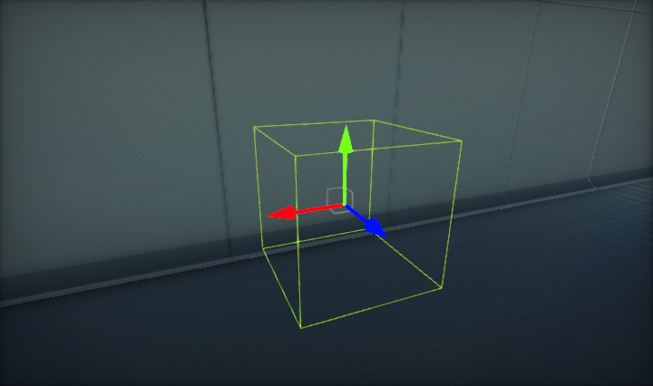
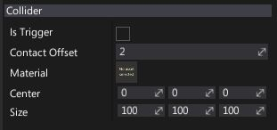

# Box Collider

A box-shaped primitive collider.

## Properties

| Property | Description |
|--------|--------|
| **Is Trigger** | If checked, collider will be a trigger. See [Triggers](../triggers.md) documentation to learn more. |
| **Contact Offset** | Colliders whose distance is less than the sum of their ContactOffset values will generate contacts. The contact offset must be positive. Contact offset allows the collision detection system to predictively enforce the contact constraint even when the objects are slightly separated. |
| **Material** | The physical material used to define the collider physical properties. |
| **Center** | The center of the collider, measured in the object's local space. |
| **Size** | The size of the box, measured in the object's local space. It will be scaled by the actor's world scale. |

