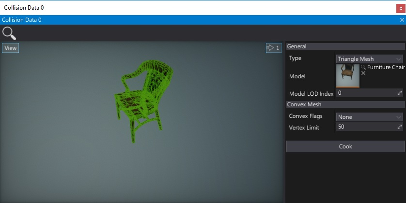
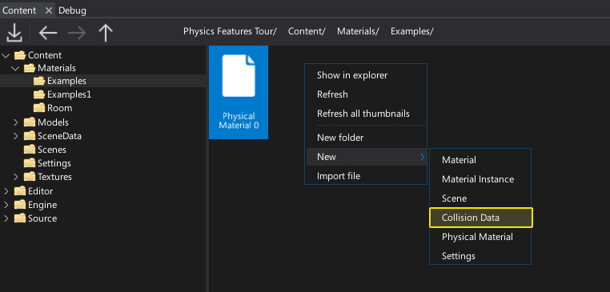
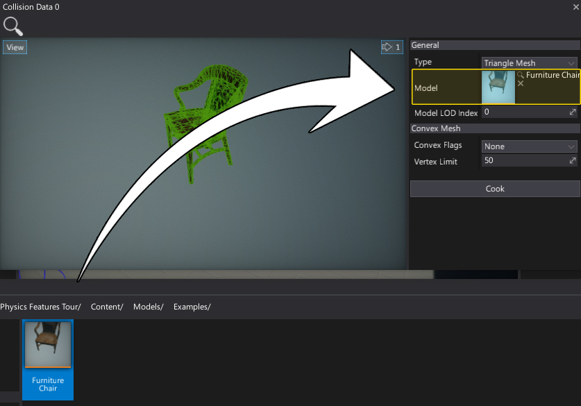

# Collision Data



**Collision Data** asset contains a baked mesh collision data used at runtime by the [Mesh Colliders](mesh-collider.md).
It supports **convex meshes** and **triangle meshes** data.

## Create a collision data

To create a new collision data asset use the *Content* window. Right-click in the Content directory and select option **New -> Collision Data**. Then specify the name and press *Enter* to confirm.



Now open the asset (double-click on it) and assign the model to use for a collider shape (set the **Model** property). Then press **Cook** button.



## Properties

| Property | Description |
|--------|--------|
| **Type** | Collision data type. |
| **Model** | Source model used to generate the collision mesh. Used are all the meshes from the selected LOD. |
| **Model LOD Index** | Source model LOD index. |
| **Convex Flags** | The convex mesh generation flags. See [ConvexMeshGenerationFlags](https://docs.flaxengine.com/api/FlaxEngine.ConvexMeshGenerationFlags.html) to learn more. |
| **Vertex Limit** | The convex mesh vertex limit. Use values in range [8;255]. |

## Create collision data from code

Flax supports creating most of the asset types in Editor using C# scripts (with editor plugins). The same applies to the collision data asset. Here is an example code that bakes the asset:

```cs
var path = "Content/MyModel";
var model = Content.LoadAsync<Model>(path);
FlaxEditor.Editor.CookMeshCollision(path + "_Collision", CollisionDataType.ConvexMesh, model);
```

> [!TIP]
> When invoking the collision data cooking, please ensure to invoke it on a separate thread or via async job to not block the game thread.

If your game generates the geometry at runtime and you need to use collision for virtual models then you can enable physics settings option **Support Cooking At Runtime** (see [Physics Settings](../physics-settings.md)) and use the following code to create a virtual collision data asset:

```cs
var collisionData = Content.CreateVirtualAsset<CollisionData>();
collisionData.CookCollision(CollisionDataType.TriangleMesh, myModel);
```

