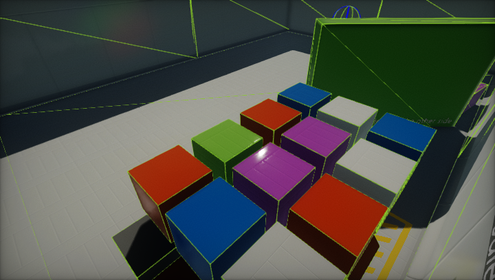

# Colliders

**Colliders** are used to define the physical shape of the objects. Colliders are invisible and don't need not be the exact same shape as the object’s mesh and in fact, a rough approximation is often more efficient and indistinguishable in gameplay.

Flax provides various *primitive* collider types, such as Box, Sphere, or Capsule. Using simple collider shapes helps with game performance optimization. However, if you need more detailed and excat collision for you object use Mesh Collider.

## Static colliders

If collider has no parent [Rigidbody](../rigid-bodies.md), then it will be a static collider.
Static colliders are used for level geometry which always stays at the same place and never moves around. Incoming rigidbody objects will collide with the static collider but will not move it.

## Rigidbody colliders

If collider has [Rigidbody](../rigid-bodies.md) parent, then it will be a used to define its shape.
Rigidbody colliders are fully simulated by the physics engine and can react to collisions and forces applied from a script. They can collide with other objects (including static colliders) and are the most commonly used Collider configuration in games that use physics.

## Debug view

In Editor viewport use widget option **View -> Debug View -> Physics Colliders** to enable drawing collisions shapes geometry. It can be sued to profile the physics scene. Static colliders are blue, dynamic colliders are pink, terrain is green, and characters are yellow.

Alternatively, you can use widget option **View -> View Flags -> Physics Debug** to profile physical shapes and physics simulation.

## In this section

* [Box Collider](box-collider.md)
* [Sphere Collider](sphere-collider.md)
* [Capsule Collider](capsule-collider.md)
* [Mesh Collider](mesh-collider.md)
  * [Collision Data](collision-data.md)
