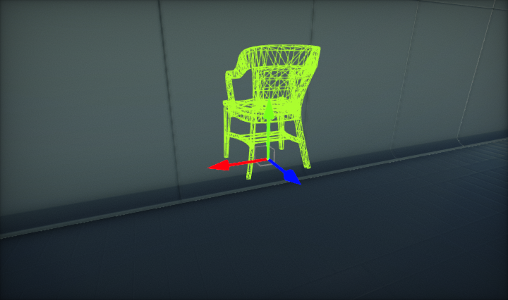
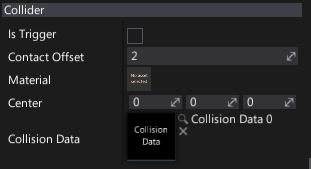

# Mesh Collider

A collider represented by an arbitrary mesh. See [Collision Data](collision-data.md) asset documentation to learn more about creating the convex and triangle meshes.
## Properties

| Property | Description |
|--------|--------|
| **Is Trigger** | If checked, collider will be a trigger. See [Triggers](../triggers.md) documentation to learn more. |
| **Contact Offset** | Colliders whose distance is less than the sum of their ContactOffset values will generate contacts. The contact offset must be positive. Contact offset allows the collision detection system to predictively enforce the contact constraint even when the objects are slightly separated. |
| **Material** | The physical material used to define the collider physical properties. |
| **Center** | The center of the collider, measured in the object's local space. |
| **Collision Data** | Linked collision data asset that contains convex mesh or triangle mesh used to represent a mesh collider shape. |

