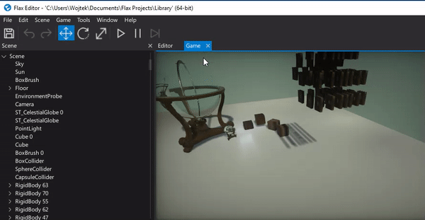

# Collisions



This page describes how to filter and detect objects collisions.

## Collisions filtering

Flax supports up to 32 different collision layers. Each layer can have different collisions mask defined globally.
You can use [Physics Settings](physics-settings.md) to define the layers collisions mask matrix.
Every actor has property [Actor.Layer](https://docs.flaxengine.com/api/FlaxEngine.Actor.html#FlaxEngine_Actor_Layer) which is used to peek the collisions mask for the object.

## Collisions detection

Flax uses event-based collisions detection. When the content between two objects is detected it gets reported during the **fixed update**. To access those events simply implement `OnCollisionEnter`/`/OnCollisionStay`/`OnCollisionExit` methods inside your script and attach it to the rigidbody or collider to fetch the events from its collisions.

Here is an example script that prints collision info to the log:

```cs
void OnCollisionEnter(Collision c)
{
    Debug.Log("New collision: " + c.ThisCollider.Name + " <-> " + c.OtherCollider.Name);

    for (int i = 0; i < c.Contacts.Length; i++)
        Debug.Log("Contact " + i + ": " + c.Contacts[i].Point);
}
```

To access information about the collision use [Collision](https://docs.flaxengine.com/api/FlaxEngine.Collision.html) class and [ContactPoint](https://docs.flaxengine.com/api/FlaxEngine.ContactPoint.html) structures.

Alternatively, you can use the [Collider](https://docs.flaxengine.com/api/FlaxEngine.Collider.html) events to handle the collisions without using a dedicated method signature and linking script to the collider.
Here is an example script that registers for the collision detection for the given input collider in your scene.

```cs
public class MyScript : Script
{
	public Collider TargetCollider;

	void OnEnable()
	{
		TargetCollider.CollisionEnter += OnTargetCollisionEnter;
	}

	void OnDisable()
	{
		TargetCollider.CollisionEnter -= OnTargetCollisionEnter;
	}

	private void OnTargetCollisionEnter(Collision collision)
	{
		Debug.Log("We got the collision sir! With: " + collision.OtherCollider);
	}
}
```

Please keep in mind that not only Colliders may be a source of collision but also other actor types eg. Terrain. To handle this use properties **ThisActor** and **OtherActor**.

## Learn more

See [Script Events](../scripting/events.md) page to learn more about the C# script events.


