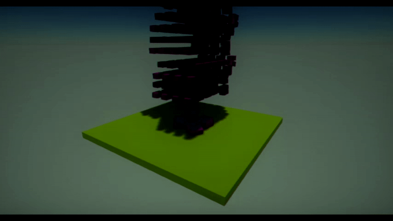

# Physics Simulation

Flax Engine provides **real-time physics simulation** including collisions, gravity and other forces.
Using built-in physics engine helps with creating realistic behaviour for game objects. This section explains how physics actors work, how to add them to your game, and how to use them with C#, C++ and Visual scripts.

**Flax uses PhysX 5.1** physics engine to drive its physical simulation calculations and perform all collision calculations. PhysX provides the ability to perform accurate collision detection as well as simulate physical interactions between objects within the world.

## In this section

* [Colliders](colliders/index.md)
 * [Box Collider](colliders/box-collider.md)
 * [Sphere Collider](colliders/sphere-collider.md)
 * [Capsule Collider](colliders/capsule-collider.md)
 * [Mesh Collider](colliders/mesh-collider.md)
   * [Collision Data](colliders/collision-data.md)
* [Rigid Bodies](rigid-bodies.md)
* [Character Controller](character-controller.md)
* [Triggers](triggers.md)
* [Joints](joints/index.md)
  * [Fixed Joint](joints/fixed-joint.md)
  * [Distance Joint](joints/distance-joint.md)
  * [Hinge Joint](joints/hinge-joint.md)
  * [Slider Joint](joints/slider-joint.md)
  * [Spherical Joint](joints/spherical-joint.md)
  * [D6 Joint](joints/d6-joint.md)
* [Raycasting](raycasting.md)
* [Collisions](collisions.md)
* [Physical Material](physical-material.md)
* [Physics Settings](physics-settings.md)
* [Vehicles](vehicles.md)
* [Ragdolls](ragdolls.md)
* [Cloth](cloth.md)

## Tutorials

* [How to create a bouncing ball](tutorials/bouncing-ball.md)
* [How to use a trigger](tutorials/use-trigger.md)

