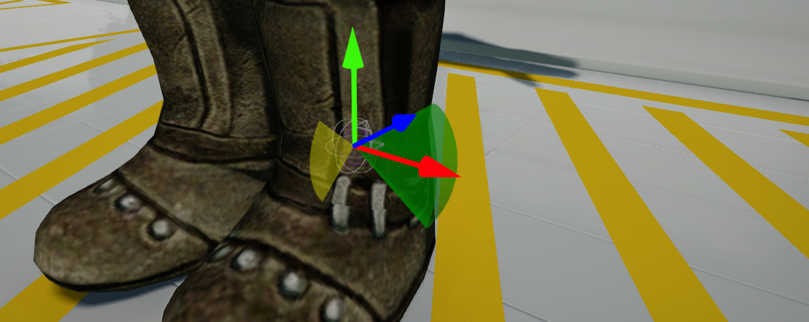
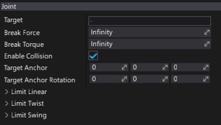

# D6 Joint

**D6 Joint** is the most customizable type of joint. This joint type can be used to create all other built-in joint types, and to design your own custom ones, but is less intuitive to use. Allows a specification of a linear constraint (for example for a slider), twist constraint (rotating around X) and swing constraint (rotating around Y and Z). It also allows you to constrain limits to only specific axes or completely lock specific axes.

D6 Joints are used by default by Ragdoll creator as they can be used to simulate various types of human body joint behavior. In debug view when selected joint shows the location and target location points as wire spheres. The twist limit is shown with a yellow arc or yellow disk. The swing cone is shown in green color where the arrow points to the middle of it.

## Joint Axis

D6 Joint uses (as a name says) 6 different axes of possible motion:
* **X** - linear movement on X axis.
* **Y** - linear movement on Y axis.
* **Z** - linear movement on Z axis.
* **Twist** - rotation around X axis.
* **SwingY** - rotation around Y axis.
* **SwingZ** - rotation around Z axis.

Each axis can use one of 3 types of motion:
* **Locked** - axis is immovable.
* **Limited** - axis will be constrained by the specified limits (eg. see Linear/Twist/Swing limits).
* **Free** - axis will not be constrained.

Each axis can be independently adjusted.

## Properties

| Property | Description |
|--------|--------|
| **Target** | The target actor for the joint. It has to be **RigidBody** or **CharacterController**. |
| **Break Force** | Determines the maximum force the joint can apply before breaking. Broken joints no longer participate in physics simulation. |
| **Break Torque** | Determines the maximum torque the joint can apply before breaking. Broken joints no longer participate in physics simulation. |
| **Enable Collision** | Determines whether a collision between the two bodies managed by the joint is enabled. |
| **Enable Auto Anchor** | Determines whether use automatic target anchor position and rotation based on the joint world-space frame (computed when creating joint). |
| **Target Anchor** | This is the relative pose which locates the joint frame relative to the target actor. |
| **Target Anchor Rotation** | This is the relative pose rotation which locates the joint frame relative to the target actor. |
| **Limit Linear** | Determines the linear limit used for constraining translation degrees of freedom. See [LimitLinear](https://docs.flaxengine.com/api/FlaxEngine.LimitLinear.html) to learn more. |
| **Limit Twist** | Determines the angular limit used for constraining the twist (rotation around X) degree of freedom. See [LimitAngularRange](https://docs.flaxengine.com/api/FlaxEngine.LimitAngularRange.html) to learn more. |
| **Limit Swing** | Determines the cone limit used for constraining the swing (rotation around Y and Z) degree of freedom. See [LimitConeRange](https://docs.flaxengine.com/api/FlaxEngine.LimitConeRange.html) to learn more. |
