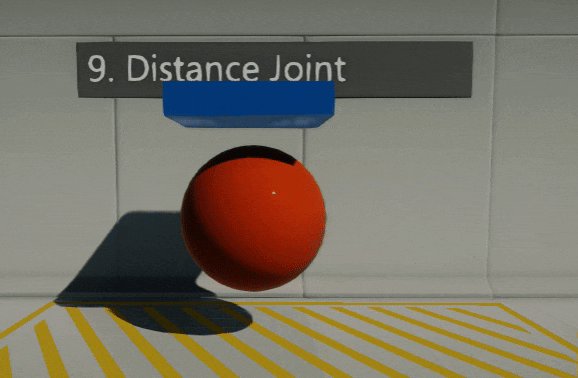

# Distance Joint

**Distance Joint** keeps the origins of the constraint actors within a certain range of distance. The range may have both upper and lower bounds.

## Properties

| Property | Description |
|--------|--------|
| **Target** | The target actor for the joint. It has to be **RigidBody** or **CharacterController**. |
| **Break Force** | Determines the maximum force the joint can apply before breaking. Broken joints no longer participate in physics simulation. |
| **Break Torque** | Determines the maximum torque the joint can apply before breaking. Broken joints no longer participate in physics simulation. |
| **Enable Collision** | Determines whether a collision between the two bodies managed by the joint is enabled. |
| **Target Anchor** | This is the relative pose which locates the joint frame relative to the target actor. |
| **Target Anchor Rotation** | This is the relative pose rotation which locates the joint frame relative to the target actor. |
| **Flags** | Controls joint behaviour. |
| **Min Distance** | The minimum distance must be no more than the maximum distance. Used only when MinDistance flag is set. |
| **Max Distance** | The maximum distance must be no less than the minimum distance. Used only when MaxDistance flag is set. |
| **Tolerance** | The error tolerance of the joint. The distance beyond the joint's [min, max] range before the joint becomes active. Default: 25, Range: [0.1, float.MaxValue]. |
| **SpringParameters** | The spring parameters. Used only when Spring flag is set. See [SpringParameters](https://docs.flaxengine.com/api/FlaxEngine.SpringParameters.html) to learn more. |

