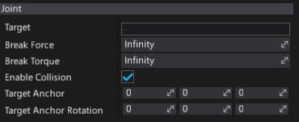

# Fixed Joint

**Fixed Joint** constrains two objects so that the positions and orientations of their constraint frames are the same. This is somewhat similar to parenting but is implemented through physics rather than the scene hierarchy. The best scenarios for using them are when you have objects that you want to easily break apart from each other, or connect two object’s movement without parenting (eg. seal objects).

## Properties

| Property | Description |
|--------|--------|
| **Target** | The target actor for the joint. It has to be **RigidBody** or **CharacterController**. |
| **Break Force** | Determines the maximum force the joint can apply before breaking. Broken joints no longer participate in physics simulation. |
| **Break Torque** | Determines the maximum torque the joint can apply before breaking. Broken joints no longer participate in physics simulation. |
| **Enable Collision** | Determines whether a collision between the two bodies managed by the joint is enabled. |
| **Target Anchor** | This is the relative pose which locates the joint frame relative to the target actor. |
| **Target Anchor Rotation** | This is the relative pose rotation which locates the joint frame relative to the target actor. |

