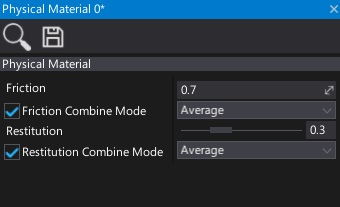

# Physical Material

The **Physical Material** asset is used to define the response of a physical object when interacting dynamically with the world.

## Create physical material

To create a new physical material asset, simply navigate to the Content directory in the *Content* window, then right-click and choose option **New -> Physics -> Physical Material**. Specify its name and press *Enter*.


## Use physical material

Physical materials are used by the colliders to define their surface properties. You can set the collider material by dragging the asset right into the **Material** property. Alternatively, you can modify the material at runtime using C# API (see [Collider.Material](https://docs.flaxengine.com/api/FlaxEngine.Collider.html#FlaxEngine_Collider_Material) property).

## SFX or VFX based on material type

Every Physical Material contains a `Tag` property which identifies it for the gameplay. For example, it can be used to distinguish material types to play matching sound or visual effects when a player walks on a surface of a given type (eg. wood or grass).

Example code:

# [C#](#tab/code-csharp)
```cs
// Event called by Anim Event
private void OnFootstep(Vector3 footLocation)
{
    // Raycast at foot location to detect surface over which character walks over
    var offset = 10.0f;
    var maxDistance = 100.0f;
    if (Physics.RayCast(footLocation + Vector3.Up * offset, Vector3.Down, out RayCastHit hitInfo, maxDistance))
    {
        // Get surface under floor
        if (hitInfo.Collider is Collider collider && collider.Material)
        {
            var material = (PhysicalMaterial)collider.Material.Instance;
            if (material.Tag == "Surface.Wood")
            {
                // play sfx/vfx...
            }
        }
    }
}
```
# [C++](#tab/code-cpp)
```cpp
#include "Engine/Physics/Physics.h"
#include "Engine/Physics/PhysicalMaterial.h"
#include "Engine/Physics/Colliders/Collider.h"

// Event called by Anim Event
void PointLight::OnFootstep(Vector3 footLocation)
{
    // Raycast at foot location to detect surface over which character walks over
    const float offset = 10.0f;
    const float maxDistance = 100.0f;
    RayCastHit hitInfo;
    if (Physics::RayCast(footLocation + Vector3::Up * offset, Vector3::Down, hitInfo, maxDistance))
    {
        // Get surface under floor
        auto collider = Cast<Collider>(hitInfo.Collider);
        if (collider && collider->Material)
        {
            auto material = collider->Material->GetInstance<PhysicalMaterial>();
            if (material->Tag == TEXT("Surface.Wood"))
            {
                // play sfx/vfx...
            }
        }
    }
}
```
***

## Properties



| Property | Description |
|--------|--------|
| **Friction** | The friction value of surface, controls how easily things can slide on this surface. The default value is `0.7`. |
| **Friction Combine Mode** | The friction combine mode, controls how friction is computed for multiple materials. Possible options: <table><tbody><tr><th>Option</th><th>Description</th></tr><tr><td>**Average**</td><td>Uses the average value of the touching materials: (a+b)/2.</td></tr><tr><td>**Mininum**</td><td>Uses the smaller value of the touching materials: min(a,b).</td></tr><tr><td>**Multiply**</td><td>Multiplies the values of the touching materials: a\*b.</td></tr><tr><td>**Maximum**</td><td>Uses the larger value of the touching materials: max(a, b).</td></tr></tbody></table>|
| **Restitution** | The restitution or 'bounciness' of this surface, between 0 (no bounce) and 1 (outgoing velocity is same as incoming). The default value is `0.3`. |
| **Restitution Combine Mode** | The restitution combine mode, controls how restitution is computed for multiple materials. Possible options: <table><tbody><tr><th>Option</th><th>Description</th></tr><tr><td>**Average**</td><td>Uses the average value of the touching materials: (a+b)/2.</td></tr><tr><td>**Mininum**</td><td>Uses the smaller value of the touching materials: min(a,b).</td></tr><tr><td>**Multiply**</td><td>Multiplies the values of the touching materials: a\*b.</td></tr><tr><td>**Maximum**</td><td>Uses the larger value of the touching materials: max(a, b).</td></tr></tbody></table>|
| **Density** | Physical material density in kilograms per cubic meter (kg/m^3). Higher density means a higher weight of the object using this material. Wood is around 700, water is 1000, steel is around 8000. |
| **Tag** | Physical material tag used to identify it (eg. `Surface.Wood`). Can be used to play proper footstep sounds when walking over object with that material. |
